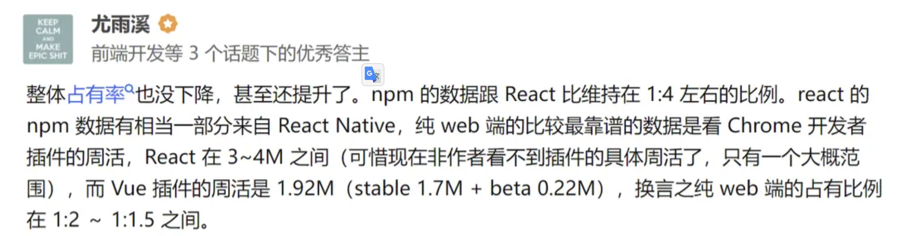

## 1、App开发模式

1. **原生开发：**

   > 原生开发（Native App开发），是在Android、IOS等移动平台上利用官方提供的开发语言、开发类库、开发工具进行App开发。比如Android是利用Java、Eclipse、Android studio；IOS是利用Objective-C 和Xcode进行开发。

   优点：

   1. 可访问手机所有功能（如GPS、摄像头等）、可实现功能最齐全；
   2. 运行速度快、性能高，绝佳的用户体验；
   3. 支持大量图形和动画，不卡顿，反应快；
   4. 兼容性高，每个代码都经过程序员精心设计，一般不会出现闪退的情况，还能防止病毒和漏洞的出现；
   5. 比较快捷地使用设备端提供的接口，处理速度上有优势。

   缺点：

   1. 开发时间长，快则3个月左右完成，慢则五个月左右；

   2. 制作费用高昂，成本较高；

   3. 可移植性比较差，一款原生的App，Android和IOS都要各自开发，同样的逻辑、界面要写两套；

   4. 内容限制（App Store限制）；

   5. 必须等下载完毕用户才可以打开，获得新版本时需重新下载应用更新。

   6. 新需求迭代，上线慢。

      

2. **web APP(h5/即HTML5开发)**：

   > HTML5应用开发，是利用Web技术进行的App开发，可以在手机端浏览器里面打开的网站就称之为webapp。Web技术本身需要浏览器的支持才能进行展示和用户交互，因此主要用到的技术是HTML、CSS、Javascript以及jQuery、Vue、React等JS框架。

   优点：

   1. 支持设备范围广，可以跨平台，编写的代码可以同时在Android、IOS、Windows上运行；
   2. 开发成本低、周期短；
   3. 无内容限制；
   4. 适合展示有大段文字（如新闻、攻略等），且格式比较丰富（如加粗，字体多样）的页面；
   5. 用户可以直接使用最新版本（自动更新，不需用户手动更新）。

   缺点：

   1. 由于Web技术本身的限制，H5移动应用不能直接访问设备硬件和离线存储，所以在体验和性能上有很大的局限性；
   2. 对联网要求高，离线不能做任何操作；
   3. 功能有限；
   4. APP反应速度慢，页面切换流畅性较差；
   5. 图片和动画支持性不高；
   6. 用户体验感较差；
   7. 无法调用手机硬件（摄像头、麦克风等）。

3. **Hybrid APP开发**：

   > 混合开发（Hybrid App开发），是指在开发一款App产品的时候，为了提高效率、节省成本而利用原生与H5的开发技术的混合应用。通俗点来说，这就是网页的模式，通常由“HTML5云网站+APP应用客户端”两部份构成。 混合开发是一种取长补短的开发模式，原生代码部分利用WebView插件或者其它框架为H5提供容器，程序主要的业务实现、界面展示都是利用与H5相关的Web技术进行实现的。比如京东、淘宝、今日头条等APP都是利用混合开发模式而成的。

优点：

1. 开发效率高，节约时间。同一套代码Android和IOS基本上都可使用；
2. 更新和部署比较方便，每次升级版本只需要在服务器端升级即可，不再需要上传到App Store进行审核；
3. 代码维护方便、版本更新快，节省产品成本；
4. 比web版实现功能多；
5. 可离线运行。

缺点：

1. 功能/界面无法自定：所有内容都是固定的，不能换界面或增加功能；
2. 加载缓慢/网络要求高：混合APP数据需要全部从服务器调取，每个页面都需要重新下载，因此打开速度慢，网络占用高，缓冲时间长，容易让用户反感；
3. 安全性比较低：代码都是以前的老代码，不能很好地兼容最新手机系统，且安全性较低，网络发展这么快，病毒这么多，如果不实时更新，定期检查，容易产生漏洞，造成直接经济损失；

### 1.1、Hybrid APP开发 （混合开发）

- 主流渲染引擎：webview、[react](https://so.csdn.net/so/search?q=react&spm=1001.2101.3001.7020) native(rn)/weex、flutter，复杂度依次降低，渲染性能依次上升。（uni-app是双渲染引擎，webview和weex都内置了，随便开发者使用切换）

  > WebView：WebView是一种控件，它基于[webkit](https://so.csdn.net/so/search?q=webkit&spm=1001.2101.3001.7020)引擎，因此具备渲染Web页面的功能。基于Webview的混合开发，就是在 Anddroid os(安卓)/I os(苹果)原生APP里，通过WebView控件嵌入Web页面。

- 跨端开发方案
  - 原生+webview：略
  - 纯webview：略
  - **flutter**：跨平台移动UI框架
  - **react native** (rn)/ weex：跨平台移动应用开发框架，react native与react配合，vue 与weex配合
  - 小程序：**uniapp**(虽可以跨端，但多用于小程序开发，其他性能不好)、**taro**

|    架构     |                             优势                             |                             劣势                             |
| :---------: | :----------------------------------------------------------: | :----------------------------------------------------------: |
|   flutter   | 在终端绘制性能较好,支持跨平台，完美通信原生端，可自由在原生端编写代码 | 需要学习dart,android,ios,热更新默认不支持，使用第三方支持了也会损耗性能，编写过程中书写代码如果不会封装，很容易造成嵌套地狱,社区并不是非常活跃，还是有挺多的issue需要解决，第三方包并不会太多需要持续观察 |
| reactNative | 终端绘制采用android绘制，性能偏好，架构设计完全处于还原android原生理念，支持热更新，完美通信原生端，与原生端直接挂钩，息息相关，可自由书写原生代码，比较灵活 | 需要桥接过程中的损耗，需要学习android，ios，react，虽然灵活，但维护成本却并不小 |
|   uniApp    | vue书写比较简单上手，比起原生，rn，flutter开发速度都是超级快速简单，学习成本较低，支持平台较多，一次编写，处处可运行的理念 |  性能问题存在瓶颈，原生通信受限制，需要根据官方提供间接通信  |

市场上很多APP采用rn和flutter开发，但是原生APP依然是性能最好的，大厂一般采用这些

小程序开发大部分是uniAPP和taro，中小厂可能比较多，需要产品快速上线，成本低，uniAPP也可以做APP但是相较于其他没优势

## 2、web前端开发(pc端)

- #### 一🚀 框架：“三足鼎立”到“两大集团对峙”

  - react
  - vue
  - angular

**React 和 Vue市场对比：**

