# 前端常考面试题

# 一、JavaScript

## 1.事件循环

> 考察方式： 可能需要描述一遍或者直接给你题目让你说出打印结果

**🍔总结**：

首先先执行主线程上的同步任务，遇到异步任务将其放入微任务队列，宏任务放入**宏任务队列**，微任务放入**微任务队列**，当同步代码执行完毕后，会去检查微任务队列中是否有事件存在，如果存在，则会依次执行微任务队列中的所有事件对应的回调。然后去宏任务队列中取出一个事件，执行对应回调，当前任务执行完毕再检查微任务队列中是否有事件存在。无限重复此过程，就会形成一个无限循环，这个循环就叫做事件循环

🍟拓展：

JS是一门单线程非阻塞的脚本语言，任何时候都只有一个主线程处理任务。非阻塞指当代码需要处理异步任务时，主线程会挂起这个任务，当异步任务处理完毕之后，主线程再根据一定规则(事件循环)去执行相应的回调

🍿计算机中的同步与异步

- 同步：直接进入主线程执行栈，执行完一个任务，再执行另外一个任务

- 异步；不进入主线程执行栈，而是进⼊**任务队列**，当主线程上的任务执行完后，才会执行任务队列里的任务。

🍿JS中的同步与异步任务

- **同步任务**：即主线程上的任务，按照顺序由上至下依次执行，当前⼀个任务执行完毕后，才能执行下⼀个任务。

- **异步任务**：不进入主线程执行栈，而是进⼊任务队列的任务，当主线程上的任务执行完后，才会执行任务队列里的任务。

  异步任务分为宏任务和微任务

  - 宏任务：**script**整体代码块(可以理解为主线程上的任务)，**setTimeout**、**setInterval**、setImmediate(Node.js 环境)、UI事件、I/O（Node.js）
  - 微任务：**Promise.then( )**、**Promise.catch( )**、**Promise.finally( )**、**process.nextTick( )**、**await** **fn()** 之后的代码

  > new Promise({ code }) code这里面的都当作同步代码执行，async function fn() { code1 **await** code2; code3}  code1,code2 是同步代码，code3是异步任务

例题： 

```js
console.log('1'); 
async function fn1() {  	
    await fn2()    
console.log('5')  
}  //5
async function fn2() {  
    console.log('2')  
}        
fn1();
setTimeout(function() {  
    console.log('8')  
}, 0)  
new Promise(resolve => {  
    console.log('3')  
    resolve()  
}) 
.then(function() { 
        console.log('6')  
})  
.then(function() { 
    console.log('7') 
}) 
console.log('4'); 
// 打印结果 1 2 3 4 5 6 7 8
```


## 2.this指向

函数的this在调用时绑定，取决于函数的调用方法

`关于方法的调用我所知道的有4种`

1, 普通函数指向函数的调用者

> 有个简便的方法就是看函数前面有没有点,如果有点,那么就指向点前面的那个值;

2, 箭头函数指向函数定义时所在的作用域: 

> 注意理解作用域,只有`函数的{}`构成作用域,`对象的{}`以及 `if(){}`都不构成作用域;

```js
const obj = {
    name: 'objName',
    say() {
        console.log(this.name);
    },
    read: () => {
        console.log(this.name);
    }
}
obj.say(); // objName 普通函数，调用者为obj
obj.read(); // undefined 箭头函数 this指向函数定义时的作用域 当前作用域为全局环境，因此找不到this.name
```

- 浏览器默认的this为window

```js
function test() {
    console.log(this);
}
test(); //window
```

- node.js中全局环境默认`this为{}`,普通函数中默认`this为global`

```js
console.log(this); // {}
function test() {
   console.log(this);
}
test(); //global
```

注意：node环境下定义在全局的变量不会绑定到global，需要global. 来绑定，浏览器也会自动绑定到全局环境window

[两句话理解js中的this - 掘金 (juejin.cn)](https://juejin.cn/post/6844903511868571656)

例题1

```js
var length = 10;
function fn() {
 console.log(this.length);
}
const  obj = {
    length: 5,
    method: function(fn) {
        fn();
        arguments[0]();
    }
};
obj.method(fn, 1);//10 2
```

例题2

```js
window.val = 1;
var obj = {
    val: 2,
    dbl: function() {
        this.val *= 2;
        val *= 2;
        console.log(val);
        console.log(this.val);
    }
}
obj.dbl(); // 2 4
var func = obj.dbl;
func(); // 8 8
```

## 3.箭头函数和普通函数区别

**🍔总结：**

①**声明方式不同**，普通函数需要function关键字来声明，既可声明具名函数也可声明匿名函数，但箭头函数只能声明匿名函数，但可以通过表达式方式让箭头函数具名；

②**this指向不同**，普通函数的this指向函数运行时所在的对象，但是箭头函数没有自己的this，它的内部this指向定义箭头函数的上下文，箭头函数this是固定的，call、apply、bind都不能改变this指向，普通函数this是不固定的；

③箭头函数没有原型对象，也不能当作构造函数new(因为没有this)，参数名不能重复；

④箭头函数没有new.target(返回`new`调用的那个构造函数)和**没有自己的arguments**(可以使用rest参数替代)；

⑤不能用作Generator函数，不能使用yeild关键字。

> **简单版：箭头函数与普通函数**的区别在于：
> 1.箭头函数没有自己的this，this在定义时确定而不是运行时确定。
> 2.不可以当作构造函数，没有原型对象，参数名不能重复。
> 3.自身arguments对象，可用rest参数代替。
> 4.不可以使用**yield**对象，因此箭头函数不能用作**Generator**函数。
> 5.不存在super、new.target，不能用call、apply、bind改变this指向。

https://juejin.cn/post/7069943937577779214#heading-3  具体细节可以看一下这篇文章

补充：箭头函数是匿名函数，匿名函数与具名函数的区别如下：
1.匿名函数在栈追踪中不会显示出有意义的函数名，使得调试很困难。
2.若没有函数名，当函数需要引用自身时只能使用已过期的arguments.callee引用。（递归，事件触发后事件监听器需要解绑自身）
3.函数名称对于代码可读性/可理解性很重要

## 4.作用域、作用域链的理解

**🍔总结：**

作用域是一套用于确定在何处及如何**查找变量**的规则，简单来讲作用域就是查找变量的地方。作用域分为全局作用域和函数作用域和块级作用域。最外层定义的函数以及变量拥有全局作用域。在函数内部定义的变量，拥有函数作用域。使用let或const声明的变量，如果被一个大括号括住，那么这个大括号括住的变量就形成了一个块级作用域。

作用域链：JS执行函数时，首先会在当前作用域中查找对应的变量名，如果找不到，则会去父级作用域找，再找不到则会去更上一层的作用域查找，知道找到window对象才终止，这就叫作用域链。

🍟拓展：

🍿作用域分类

- 全局作用域：web浏览器中，全局作用域是window；Node环境中，全局作用域是global
- 局部作用域：
  - 函数作用域：函数内声明的变量拥有函数作用域
  - 块级作用域：在大括号{ }中使用const、let声明的变量，拥有块级作用域

🍿作用域中变量的查找规则(实现机制)

```js
var name = 'g'
```

这段代码发生了两个动作：

- 编译器在当前作用域声明了一个变量name
- 运行时引擎在作用域中用 LHS 查找到该变量，并为其赋值
- 获取变量的值,就会使用 RHS 查询

> LHS 和 RHS 查询都会在当前执行作用域中开始,如果有需要(也就是说它们没有找到所需的变量),就会向上级作用域继续查找目标变量，这样每次上升一级作用域，最后抵达全局作用域(顶层),无论找到或没找到都将停止。

🍿词法作用域

变量定义是所在的上下文

## 5.闭包与闭包的内存泄漏

🍔总结：

**闭包：**可以访问另一个函数作用域内变量的函数，(闭包就是一个函数)，闭包它记录了函数所在的作用域。垃圾回收机制正因为闭包的这个特点而不能释放内存。闭包的滥用会导致导致内存能分配的空间变少, 导致内存泄漏，最终崩溃。

**内存泄漏：**闭包产生的内存泄漏就是因为闭包对象 `Closure` 无法被释放回收

- 每一个函数在执行之前都会进行预编译，预编译时会创建一个空的闭包对象。
- 每当这个函数预编译时遇到其内部的函数声明时，会快速的扫描内部函数使用了当前函数中的哪些变量，将可能使用到的变量加入到闭包对象中，最终这个闭包对象将作为这些内部函数作用域链中的一员。
- 只有所有内部函数的作用域链都被释放才会释放当前函数的闭包对象，所谓的闭包内存泄漏也就是因为闭包对象无法释放产生的。

> 闭包与防抖、节流的关系

[一文颠覆大众对闭包的认知 - 掘金 (juejin.cn)](https://juejin.cn/post/7079995358624874509#heading-0)

## 6.JS数据类型和类型判断

🍔总结：

1. 基本数据类型：Undefined、Null、Boolean、Number、String，存放在栈中。ES6新增Symbol(独一无二的，主要是为了解决变量冲突)和BigInt(存储和操作大整数)
2. 引用数据类型：对象类型Object type，比如：Object、Array、Function、Data，RegExp等，对象存放在堆中，在栈中存储的是引用地址，指向堆中对象

🍟数据类型判断方式

##### **typeof**

```js
console.log(typeof undefined);      // undefined
console.log(typeof null); 			// object
```

##### **instanceof**     

内部运行机制是判断一个对象构造函数的prototype属性(即原型对象)是否存在该对象的原型链上

```js
console.log(function(){} instanceof Function);       // true
console.log({} instanceof Object);                   // true
```

## 7.原型链及其应用场景

**原型链：**当我们使用构造函数新建的一个对象的时候，这个对象里面包含了一个指针__proto__，这个指针指向了构造函数的prototype属性(属性值是原型对象)，里面就包含了构造函数所有的共享方法和属性。当我们访问这个对象的某个属性时，如果他身上不存在，就会去他的原型对象上去找，原型对象又有自己的原型，这样一层一层嵌套，形成的链式结构，叫原型链，原型链的终点是null

**应用场景：**原型的作用是用来共享方法的(就像一个共享区间一样)，比如我们平时用的数组，对象，这些API，还有判断数据类型Object.prototype.toString.call()方法, instanceof方法，在vue中使用插件，将其挂载到vue的原型上，都是利用原型来实现的。


## 8.var let const的区别

🍔总结：

作用域：var 声明的范围是函数作用域，let 和 const 声明的范围是块作用域

变量提升：var 声明的变量会被提升到函数作用域的顶部，let 和 const 声明的变量不存在提升，且具有暂时性死区特征

重复声明：var 允许在同一个作用域中重复声明同一个变量，let 和 const 不允许

全局变量：在全局作用域中使用 var 声明的变量会成为 window 对象的属性，let 和 const 声明的变量则不会

const 的行为与 let 基本相同，唯一一个重要的区别是，使用 const 声明的变量必须进行初始化（是个常量），且不能被修改（当然只是值不能修改，如果是引用类型可以改变指向对象的内容）

🍟拓展：

> 变量提升：就是可以在声明之前对其进行访问，但只是声明被提升，赋值并没有被提升。
>
> 函数提升：优先级高于变量提升。函数声明会被提升，函数表达式不会被提升--被提升的只是函数声明的变量名，箭头函数没有函数提升
>
> ```js
> function fn1 () {}//函数声明
> const fn2 = function () {}//函数表达式
> ```
>
> 暂时性死区：由const、let声明的变量在声明前被访问(或者说被使用)，会出现暂时性死区

## 9.ES6的新特性

## 10.for in 和 for of、forEach的区别

🍔总结：

**for...in** 语句以任意顺序遍历一个对象中除Symbol以外的**可枚举属性键**，更适合遍历对象，它会遍历对象所有的可枚举属性**键**，包括原型上的属性键。**for...of** 遍历**可迭代对象**的**属性值**（包括Array、Map、Set、String、arguments），不能遍历普通对象（除非普通对象实现了[Symbol.iterator]接口，它指向一个函数，这个函数可以返回迭代器对象），与forEach不同的是，它可以正确响应break、continue和return语句。forEach()是遍历数组的方法。

> 这里解释下可迭代对象：可迭代对象就是对象含有iterator接口，形象点说就是对象中有一个[Symbol.iterator]的属性，这个属性指向一个迭代器生成函数，for...of会自动调用这个函数，并生成迭代器对象，自动调用执行器next()来遍历对象中的属性值。---next()是生成器generator的知识。关于类数组arguments需要用Array.from转成数组即可

## 11.forEach和map循环的区别

🍔总结：

相同：两者不能中断执行，遍历时会跳过数组空位，如果数据是基本数据类型，不改变原数组的值，如果数据是引用数据类型则会改变。

不同：`forEach`**没有返回值**，`map`**有返回值**，返回一个等长的**新数组**。性能开销`forEach`比`map`大，原因是map需要返回一个新数组。

关于对改变数组的情况：两个都可以接收一个回调函数，回调函数的第一个参数是item，第二个是index下标，传入的参数item并不是原数组中的值，而是复制了一份新变量，值和原数组相同，如果item是基本数据类型，那么并不会改变原数组里的值，如果是引用类型，那么item和原数组里面的值指向同一内存地址，可以对地址里指向的对象内容进行修改。

|                                |   forEach    |            map             |
| :----------------------------: | :----------: | :------------------------: |
|          是否有返回值          |      无      |             有             |
|          能否中断执行          |     不能     |            不能            |
|        是否跳过数组空位        |     跳过     |            跳过            |
| 是否改变原数组（基本数据类型） | 不修改原数组 | 不改变原数组，并返回新数组 |
|          相对性能开销          |      小      |             大             |


```js
// 🍿没有返回值 b为undefined
var a = [1, 2, 3, 4, 5]
var b = a.forEach((item) => {
    return item = item * 2
})
var c = a.map((item) => {
    return item = item * 2
})
console.log(a) // forEach和map都没有修改原数组
console.log(b) // undefined-------forEach没有返回值
console.log(c) // [2,4,6,8,10]----有返回值 c能接收到

// 🍿无法break break需要使用for循环
for (var i = 0; i < arr.length; i++) {
    if (arr[i] === 2) break;
    console.log(arr[i]);
}

// 🍿跳过数组空位
var a = [null, , undefined]
for (let i = 0; i < a.length; i++) {
    console.log('a', a[i]) // null undefined undefined for循环无法跳过
}
a.forEach(item => {
    console.log('item', item) // null undefined forEach 跳过了空位
});
a.map(item => {
    
})
```

🍟关于改变数组的情况 forEach和map一样

```js
var a = [1,2,3,4,5]
a.forEach((item) => {
    item = item * 2
})
console.log(a) // [1,2,3,4,5]

// 这里并没有改变原数组 是因为item是一个副本而已
var a = [1,'1',{num:1},true] 
a.forEach((item, index, arr) => {
    item = 2 
}) 
console.log(a) // [1,'1',{num:1},true]
// 这也没有改变原数组中的对象，因为只是修改了新创建的变量的值

var a = [1,'1',{num:1},true] 
a.forEach((item, index, arr) => { 
    item.num = 2 
    item = 2
}) 
console.log(a)  // [1,'1',{num:2},true]
// 修改了原数组中变量指向的引用地址中的对象的属性
```

## 12.bind、call和apply的区别

🍔总结：

三个方法都是调用函数并显式地指定this指向，其中 apply 方法接收两个参数：第一个是 this 绑定的对象，第二个是参数数组。call 方法接收的参数，第一个是 this 绑定的对象，第二个参数是参数列表。也就是说，在使用 call() 方法时，传递给函数的参数必须逐个列举出来。bind 方法通过传入一个对象，返回一个 this 绑定了传入对象的新函数。这个函数的 this 指向除了使用 new 时会被改变，其他情况下都不会改变。bind方法是绑定this并返回一个新的函数

相同：都是调用函数并指定this指向

不同：参数，第一个皆为this绑定的对象，apply的第二个参数只能是数组；call的第二个参数是参数列表；bind最奇特，它会返回一个this绑定了传入对象的**新函数**

## 13.js隐式转换

## 14.js垃圾回收机制

## 15.js垃圾回收机制

🍔总结：

JS中垃圾回收机制有两种：标记清除和引用计数。①标记清除是js最常用的垃圾回收方式，当变量进入执行环境就标记这个变量进入环境，在逻辑上讲就永远不能释放该变量所占用的内存，只有当变量离开环境时，则将其标记为离开环境

## 16.js的类继承

## 17.有了解过设计模式吗

## 18.模块化和前端工程化

# 二、CSS

## 前置知识：

### 盒子模型：

也就是我们写的css属性的width和height是指哪个宽度和高度，默认是标准盒模型，一个盒子由margin+border+padding+content来组成，我们写的css的width和height是指content的宽高，接下来基本都是用这个盒子模型。还有一个是怪异盒子模型，我们写的css的width是指border×2 +padding×2+content的大小，内部元素只能撑满content

### css的元素层叠顺序：

> 类似图层一样，确定元素层级，层级高就显示谁，层级低的会被覆盖。还有层级高的能感受到层级低的元素的存在，可以用另外一种方式解释为什么浮动的元素会导致高度塌陷，因为浮动之后元素层级变高，所以低层级的父元素感受不到浮动元素的存在，便不会包裹该浮动元素。css3的有点复杂 0 0

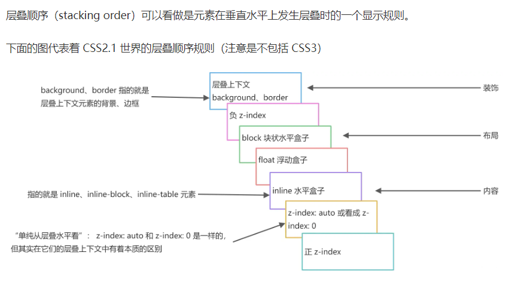

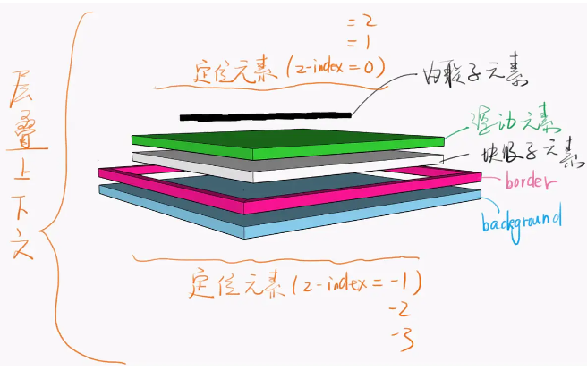

## 1.CSS中的position属性

position 是指定位类型，取值类型可以有：static、relative、absolute、fixed、inherit和sticky，这里sticky是CSS3新发布的一个属性

🎁总结

**static**：无定位，处于正常文档流；

**relative**；相对定位，相对于它自己本身的位置的定位，不脱离文档流，元素原本的位置仍在文档中占位置；

**absolute**：绝对定位， 相对于它最近的设置过position属性(如:relative、obsolute、fixed)的祖先元素来进行定位。如果祖先元素中没有设置，默认相对于body定位。会脱离文档流，即在文档中不占据位置。

**fixed**：固定定位(算是一种特殊的绝对定位)，相对于浏览器窗口来定位。

**sticky**：粘性定位，可以说是relative和fixed的结合，一开始以正常文档流进行relative相对定位，一旦达到粘性定位的条件后，就会脱离文档流，进行fixed固定定位。

**inherit**：继承父元素的position属性。这里的定位都是通过偏移如：left、top、right、bottom来定位特定位置的。

✨拓展：

##### ①relative

下面是正常的文档流布局，接下来修改以下红色元素的相对定位

浏览器中显示如下：

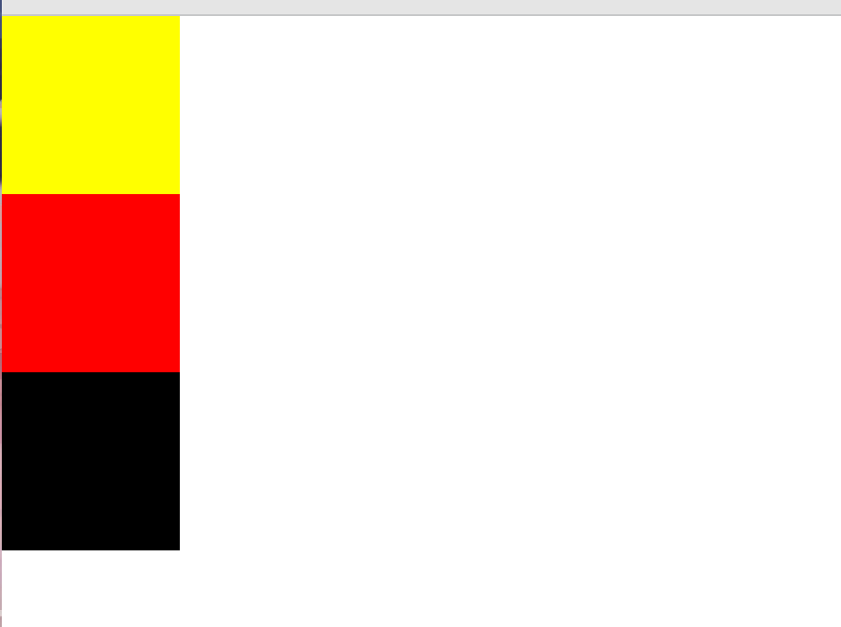

代码如下：

```js
<!DOCTYPE html>
<html lang="en">

<head>
    <meta charset="UTF-8">
    <meta http-equiv="X-UA-Compatible" content="IE=edge">
    <meta name="viewport" content="width=device-width, initial-scale=1.0">
    <title>Document</title>
    <style>
       * {
            margin: 0px;
            padding: 0px;
        }
        .container {
            width: 100%;
            height: 300px;
        }
        .content {
            width: 100px;
            height: 100px;
        }
        .yellow {
            background-color: yellow;
        }
        .red {
            background-color: red;
        }
        .black {
            background-color: black;
        }
    </style>
</head>
<body>
    <div class="container">
        <div class="yellow content"></div>
        <div class="red content"></div>
        <div class="black content"></div>
    </div>
</body>
</html>
```

修改相对定位后，浏览器显示如下

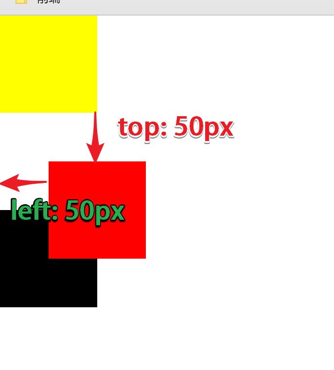

```js
.red {
    background-color: red;
    /* 增加了相对定位 */
    position: relative;
    /* 下面是相对定位(相对于自身位置)的偏移量 top; 50px就是现在的位置顶部相对于原来位置的距离为50px*/
    left: 50px;
    top: 50px;
}
```

##### ②absolute

浏览器显示如下：

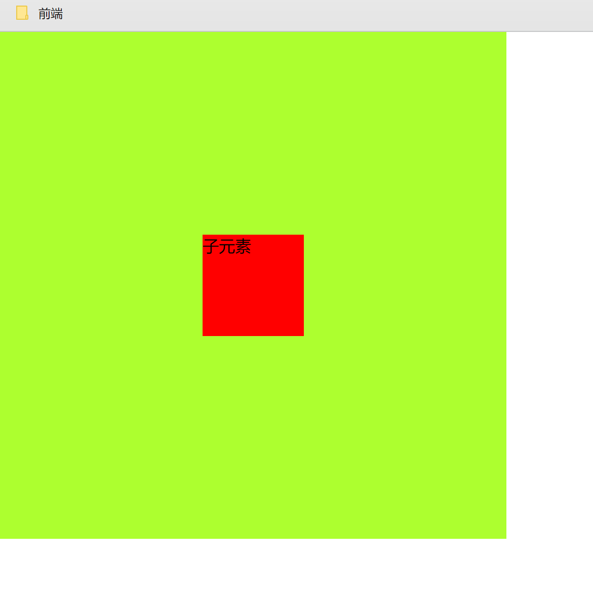

代码如下：

```js
<!DOCTYPE html>
<html lang="en">
<head>
    <meta charset="UTF-8">
    <meta http-equiv="X-UA-Compatible" content="IE=edge">
    <meta name="viewport" content="width=device-width, initial-scale=1.0">
    <title>Document</title>
    <style>
        * {
            margin: 0px;
            padding: 0px;
        }

        .father {
            height: 500px;
            width: 500px;
            background-color: greenyellow;
            position: relative;
        }

        .son {
            height: 100px;
            width: 100px;
            background-color: red;
            position: absolute;
            /* 下面是作了偏移(相对与father元素上偏移和左偏移50%父元素的距离) 并用transform进行了居中 */
            top: 50%;
            left: 50%;
            /* 相对于自己向左和向上平移50%自身距离 */
            transform: translate(-50%, -50%);
        }
    </style>
</head>
<body>
    <div class="father">
        <div class="son">
            子元素
        </div>
    </div>
</body>
</html>
```

**包裹性：**

**高度塌陷：**正常文档流，没有设置高度的父元素也会被子元素撑开（父包裹子的感觉），但是设置了浮动的子元素（如：float、position：absolute）会脱离正常文档流，父元素会感觉不到子元素的存在，认为没有子元素，所以父元素的高度不会被正常撑开，就会产生高度塌陷

**块状化：**设置position：absolute的元素，会变成行内块。。。。in-line block

## 2.CSS垂直居中和水平居中

### **2.1利用绝对定位：**

先将元素的左上角通过top:50%和left:50%定位到父元素的中心，然后再通过 translate来调整元素的中心点到父元素的中心。该方法需要考虑浏览器兼容问题。

```js
<!DOCTYPE html>
<html lang="en">

<head>
    <meta charset="UTF-8">
    <meta http-equiv="X-UA-Compatible" content="IE=edge">
    <meta name="viewport" content="width=device-width, initial-scale=1.0">
    <title>Document</title>
    <style>
        * {
            margin: 0px;
            padding: 0px;
        }
        .father {
            background-color: aqua;
            width: 100%;
            height: 500px;
            position: relative;
        
        .son {
            width: 100px;
            height: 100px;
            background-color: red;
            position: absolute;
            left: 50%;
            top: 50%;
            /* 相对自身向左上移动50%距离 */
            transform: translate(-50%,-50%);
        }
    </style>
</head>

<body>
    <div class="father">
        <div class="son"></div>
    </div>
</body>

</html>
```

效果如下：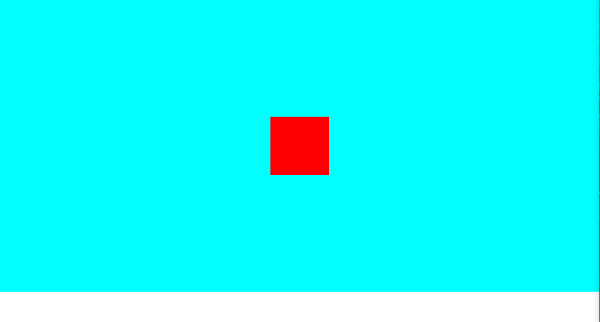

### 2.2利用绝对定位

设置四个方向的值都为0，并将margin设置为auto，由于宽高固定，因此对应方向 实现平分，可以实现水平和垂直方向上的居中。该方法适用于盒子有宽高的情况，这个方法其实son盒子铺满整个父元素，而content内容只有100px*100px，margin是自动分配撑满父元素的，而且是透明的

```js
.father {
  	background-color: aqua;
	width: 100%;
	height: 500px;
	position: relative;
	}

.son {
	position: absolute;
	top: 0;
	bottom: 0;
	left: 0;
	right: 0;
	margin: auto;
	width: 100px;
	height: 100px;
	background-color: greenyellow;
	}
```

### 2.3还是绝对定位

先将元素的左上角通过top:50%和left:50%定位到页面的中心，然后再通过margin 负值来调整元素的中心点到页面的中心。该方法适用于盒子宽高已知的情况

```js
.father {
  	background-color: aqua;
	width: 100%;
	height: 500px;
	position: relative;
	}

.son {
	position: absolute;
    top: 50%;
    left: 50%;
    width: 100px;
    height: 100px;
    background-color: brown;
    /* 自身 height 的一半 */
    margin-top: -50px;
    /* 自身 width 的一半 */
    margin-left: -50px;
	}
```

### 2.4利用flex布局

```js
.father {
   background-color: aqua;
   width: 100%;
   height: 500px;
   /* 设置父元素为flex布局 */
   display: flex;
   /* 子元素沿主轴居中布局 */
   justify-content: center;
   /* 子元素沿交叉轴居中布局 */
   align-items: center;
}

.son {
   width: 100px;
   height: 100px;
   background-color: brown;
}
```


## 3.CSS的盒子模型

🎁总结

盒子模型就是把某些标签元素看成一个盒子，box-sizing属性可以用来控制元素盒子模式。常用的两个属性值为 content-box(标准盒子模型) 和 border-box(怪异盒子模型) ，它可以改变盒子宽高的计算模式。标准盒模型一个块的宽度 = margin + padding + border + content**(width)**，CSS中设置的宽(width/height) = content宽/高。怪异盒模型(IE盒模型)一个块的宽度 = width + margin CSS中设置的宽(width/height) = 内容(content)的宽/高 + (border + padding) * 2。有块级盒子和行内盒子，还有一种特殊的盒子叫做替换元素, <iframe/>。

✨拓展：

> margin外边距：盒子与盒子之间的距离
>
> border变宽
>
> padding内边距

**1、指定盒子模型种类**

`box-sizing`  属性 

- content-box 指定为标准盒模型
- border-box 指定为怪异盒子模型(IE盒子模型)

**2、标准盒模型** /`box-sizing : content-box`

- 一个块的宽度 = width+padding+border+margin
- 我们在CSS中设置的宽/高 = 内容(content)的宽/高
- 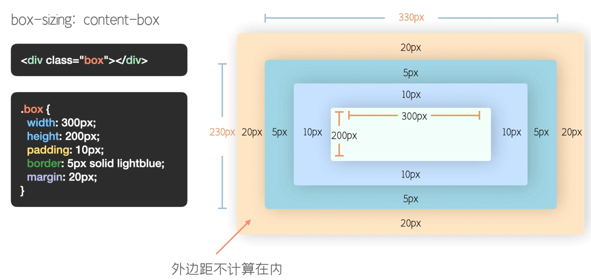

3、**怪异盒模型**/`box-sizing : border-box`

- 一个块的宽度 = width + margin 
- CSS中设置的宽/高 = 内容(content) 宽/高 + (border + padding) * 2
- 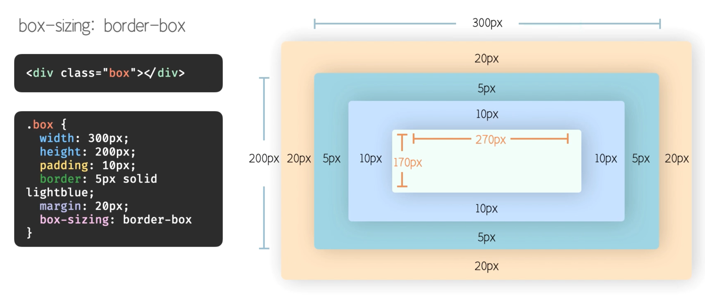

https://www.bilibili.com/video/BV13V411z7do?spm_id_from=333.337.search-card.all.click&vd_source=9b9786f75e3248b9c328703cf17cb974

## 4.flex弹性布局

实现弹性布局，只需要给容器添加display: flex| display: inline-flex属性，分别生成一个块级或行内的flex容器盒子。当设置 flex 布局之后，子元素的 float、clear、vertical-align 的属性将会失效。子元素类似于inline-block行级块元素，可以设置宽高且不换行。容器默认有两根轴：主轴和交叉轴，相当于x轴和y轴，flex-direction属性可以控制子元素的排布方向，默认不设置则为横向布局。

flex容器属性：

1. **flex-direction**: row | row-reverse | column | column-reverse;  主轴的方向（即项目的排列方向，有四种）

2. **flex-wrap**： nowrap | wrap | wrap-reverse;  如果一条轴线排不下，如何换行。 

3. flex-flow： flex-direction属性和flex-wrap属性的简写形式，默认值为row nowrap

4. **justify-content**： flex-**start** | flex-**end** | center | space-**between** | space-around; 子元素在主轴上的对齐方式。x轴

5. **align-items**： flex-start | flex-end | center | baseline | stretch; 子元素在交叉轴上如何对齐。y轴

6. align-content： flex-**start** | flex-**end** | center | space-**between** | space-around | stretch; 定义了多根轴线的对齐方式。如果项目只有一根轴线，该属性不起作用。

   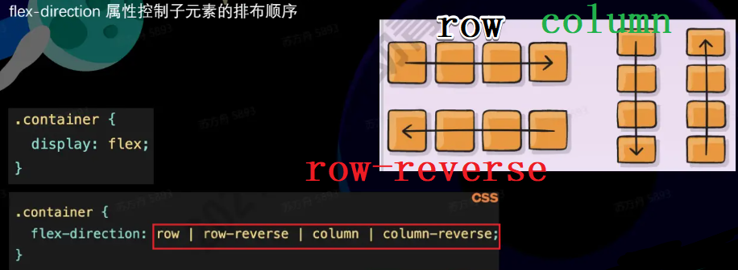

   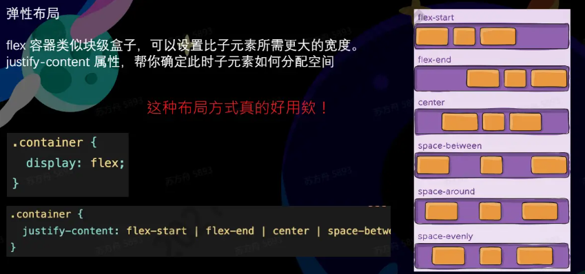

   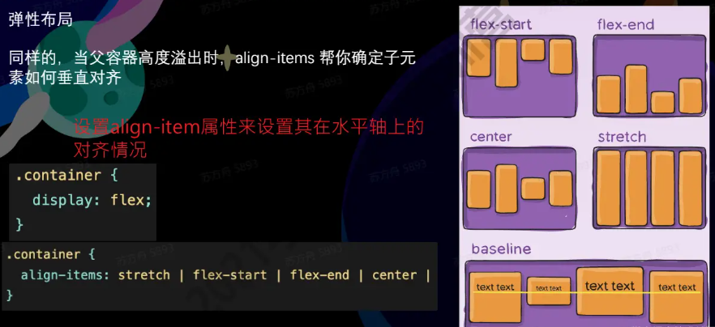

## 5.CSS实现三角形

CSS绘制三角形主要是利用border边框属性

先来看看border的表现形式

①这是盒子有宽高的表现

代码：

```js
<!DOCTYPE html>
<html lang="en">

<head>
    <meta charset="UTF-8">
    <meta http-equiv="X-UA-Compatible" content="IE=edge">
    <meta name="viewport" content="width=device-width, initial-scale=1.0">
    <title>Document</title>
    <style>
        .box {
            width: 100px;
            height: 100px;
            background: yellow;
            /* border : border-width || border-style || border-color 参数 */
            /* 参数代表 1边框宽度  2边框样式  3边框颜色 */
            border-top: 20px solid red;
            border-right: 20px solid black;
            border-bottom: 20px solid green;
            border-left: 20px solid blue;
        }
    </style>
</head>

<body>
    <div class="box">

    </div>
</body>

</html>
```

效果如下：

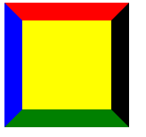

接下来我们把盒子的宽高都设置为0，只展视上面的样式代码

```js
        .box {
            /* 宽高设置为0 */
            width: 0;
            height: 0;
            background: yellow;
            /* border : border-width || border-style || border-color 参数 */
            /* 参数代表 1边框宽度  2边框样式  3边框颜色 */
            border-top: 20px solid red;
            border-right: 20px solid black;
            border-bottom: 20px solid green;
            border-left: 20px solid blue;
        }
```

效果如下:

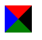

发现border是由三角形构成的

那么接下来就知道如何绘制一个三角形了

保留需要的三角形 其他样式设置为transparent 透明就好

```js
        .box {
            width: 0px;
            height: 0px;
            /* 这里只保留上边框的颜色 其他设置为透明transparent */
            border-top: 20px solid red;
            border-right: 20px solid transparent;
            border-bottom: 20px solid transparent;
            border-left: 20px solid transparent;
        }
```

就得到如下效果：

### 补充一下如何实现扇形

和实现三角形差不多，这里多加一个border-radius属性

```js
        .box {
            /* 所有边框设置为透明 */
            border: 100px solid transparent;
            width: 0;
            height: 0;
            /* 设置圆角 */
            border-radius: 100px;
            /* 上边框设置颜色 */
            border-top-color: red;
        }
```

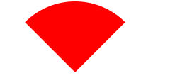

## 6.BFC是什么

🎁总结：

BFC：块级格式化上下文，是页面上用于渲染CSS的一个区域，相当于一个小型的布局，块级元素和浮动元素会根据这块区域进行布局。BFC的作用有清除浮动，包裹浮动，避免边距塌陷。创建BFC的方式：设置float属性非none的元素，overflow值除visible以外的，flex和grid布局的子元素，`display：inline-block`，多列布局等等

> 根元素，即HTML标签
>
> 浮动元素：float值为left、right
>
> overflow 值不为 visible，为 auto、scroll、hidden
> display 值为inline-block、table-cell、table-caption、table、inline-table、flex、inline-flex、- - grid、inline-grid
>
> 定位元素：position值为 absolute、fixed

解决margin重叠或者说边距塌陷

## 7.visible opacity display 盒子隐藏

主要区别在是否在**文档中占位置**和是否**影响重排(回流)和重绘**，还有是否可以绑定**事件**

**display 为 none**---------------展视形式

- 不占位置
- 会引起重排和重绘
- 无事件

**visibility 为 hidden**---------------可见性

- 依然占位置
- 会引起重绘
- 无事件

**opacity 为 0**-------------透明度

- 依然占位置
- 会引起重绘
- 自身绑定点击事件有效

transform: translate(负值)

- 依然占位置
- 会引起重绘

transform: scale(0)

- 依然占位置
- 会引起重绘

margin 负值

- 不占位置
- 会引起重排和重绘

position 为 absolute 时：边偏移负值

- 不占位置
- 会引起重排和重绘

position 为 reactive 时：边偏移负值

- 依然占位置
- 会引起重排和重绘

position 为 absolute 时：z-index 为负值

- 不占位置
- 会引起重排和重绘

position 为 fixed 时：z-index 为负值

- 不占位置
- 会引起重排和重绘

## 8.清除浮动的方式

①父元素设置为BFC模式；②给浮动元素后面增加一个清除浮动的空元素 ，clear属性`clear: left`；③使用伪元素 ，设置为块级元素；④给父元素直接设置高度，那就不会塌陷啦。⑤将父级元素也设置为float，⑥给父级元素增加定位absolute。⑤⑥问题很大，一般不用

当我们想实现这样一个布局时，代码如下

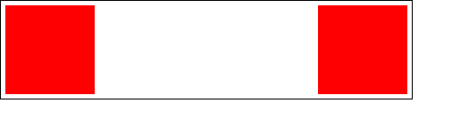

```js
<!DOCTYPE html>
<html lang="en">

<head>
    <meta charset="UTF-8">
    <meta http-equiv="X-UA-Compatible" content="IE=edge">
    <meta name="viewport" content="width=device-width, initial-scale=1.0">
    <title>Document</title>
    <style>
        * {
            margin: 0px;
            padding: 0px;
        }

        .container {
            border: 1px solid black;
            padding: 5px;
            width: 450px;
            overflow: auto;
        }

        .left {
            width: 100px;
            height: 100px;
            background-color: red;
            float: left;
        }

        .right {
            width: 100px;
            height: 100px;
            background-color: red;
            float: right;
        }
    </style>
</head>

<body>
    <div class="container">
        <div class="left"></div>
        <div class="right"></div>
    </div>
</body>

</html>
```

但是按照上面代码实际效果是：

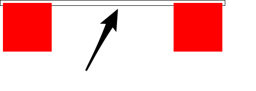

会出现**父元素高度坍塌**：因为浮动元素会脱离文档流，父元素感觉不到浮动后的子元素，高度就不会被撑开。需要清除浮动

## 9.实现三栏布局

三栏布局一般指的是页面中一共有三栏，左右两栏宽度固定，中间自适应的布局

### 9.1利用绝对定位

父元素设置高度和相对定位，左右两栏设置固定宽度并设置绝对定位，右边元素绝对定位偏移靠右上方top,right为0，中间元素把margin-left,margin-right设置为左右两元素的宽度即可，因为左右是position定位所以层级高显示在中间元素的margin上

**代码如下：**

```js
<!DOCTYPE html>
<html lang="en">

<head>
    <meta charset="UTF-8">
    <meta http-equiv="X-UA-Compatible" content="IE=edge">
    <meta name="viewport" content="width=device-width, initial-scale=1.0">
    <title>Document</title>
    <style>
        * {
            margin: 0px;
            padding: 0px;
        }

        .container {
            /* 父元素设置为相对定位 */
            position: relative;
        }
        .left {
            position: absolute;
            width: 100px;
            height: 100px;
            background-color: brown;
        }
        .right {
            position: absolute;
            top: 0;
            right: 0;
            width: 100px;
            height: 100px;
            background-color: blue;
        }
        .center {
            margin-left: 100px;
            margin-right: 100px;
            height: 100px;
            background-color: greenyellow;
        }
    </style>
</head>

<body>
    <div class="container">
        <div class="left"></div>
        <div class="center"></div>
        <div class="right"></div>
    </div>
</body>

</html>
```

效果图：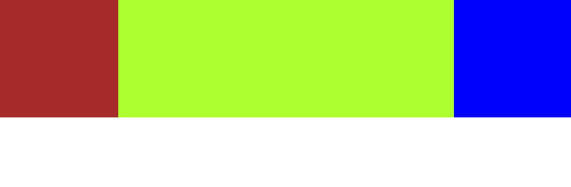

### 9.2利用flex布局

利用flex布局，左右两栏设置固定大小，中间一栏设置为flex:1，flex为1意思是剩余空间都分配给中间元素

其他代码基本和上面一样，修改样式就好，效果也和上面一样

```js
.container {
    /* 父元素设置flex布局 */
    display: flex;
	}
.left {
     width: 100px;
     height: 100px;
     background-color: brown;
     }
.right {
    width: 100px;
    height: 100px;
    background-color: blue;
    }
.center {
    flex: 1;
    height: 100px;
    background-color: greenyellow;
    }
```

### 9.3利用浮动

左右两栏设置固定大小，并设置对应方向的浮动。中间一栏设置左右两个方向的margin 值，注意这种方式，中间一栏必须放到最后

为什么中间元素必须放到最后？

> 当常规流盒子遇上浮动盒子
>
> (1)浮动盒子在摆放时会避开常规流盒子；
>
> (2)常规流盒子在摆放时会无视浮动盒子；
>
> (3)常规流盒子在自动计算高度时，无视浮动盒子——高度坍塌。

浮动之后盒子的位置

(1)左浮动的盒子向上向左排列；

(2)右浮动的盒子向上向右排列；

(3)浮动盒子的顶边不得高于上一个盒子的顶边；

(4)若剩余空间无法放下浮动的盒子，则该盒子向下移动，直至具备足够的空间可以容纳盒子，然后再向左或向右移动。

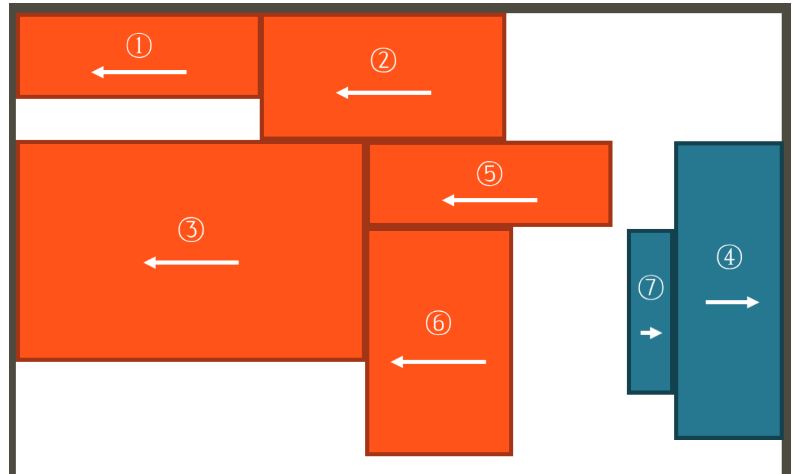

**代码如下：**

```js
<!DOCTYPE html>
<html lang="en">

<head>
    <meta charset="UTF-8">
    <meta http-equiv="X-UA-Compatible" content="IE=edge">
    <meta name="viewport" content="width=device-width, initial-scale=1.0">
    <title>Document</title>
    <style>
        * {
            margin: 0px;
            padding: 0px;
        }

        .container {
            /* 父元素设置flex布局 */
            height: 100px;
        }
        .left {
            float: left;
            width: 100px;
            height: 100px;
            background-color: brown;
        }
        .right {
            float: right;
            width: 100px;
            height: 100px;
            background-color: blue;
        }
        .center {
            /* 左右margin等于左右元素的宽度 */
            margin-left: 100px;
            margin-right: 100px;
            height: 100px;
            background-color: greenyellow;
        }
    </style>
</head>

<body>
    <div class="container">
        <div class="left"></div>
        <div class="right"></div>
        <!-- 必须把中间元素放到最后 -->
        <div class="center"></div>
    </div>
</body>

</html>
```

## 圣杯布局和双翼布局

圣杯布局和双飞翼布局， 主要解决三栏布局， **中间栏需要优先渲染的问题**， 主要运用的是margin属性和float熟悉， 主要考察margin和float的熟悉程度

**如果box没有设置宽度可以通过设置margin负值来扩大box的宽度，如果设置了宽度，将只会改变box的位置，和影响后续元素的位置，不能改变box的宽度**

margin 的left， top， right， bottom设置**负值**的分别作用

- margin-left 和 margin-top 会使元素向左和向上移动
- margin-right 和 margin-bottom 会使自身在布局中**所占的位置**减少， 使**右边的元素或下边的元素**向自身移动

### 圣杯布局

1. 给父容器container设置padding：100px
2. 给center元素添加width:100%撑满容器，设置背景颜色和高度方便看效果，left和right的宽度背景也是为了效果。
3. 将center、left、right三个元素都设置浮动
4. left元素margin-left：-100%，向左移动到了父容器宽度的距离，再设置相对定位，左偏移100px
5. right有两种方式 可以看代码，这里说一种，直接将margin-right设置为-100px，那么right就没宽度了，它就上移到第一行

```js
<!DOCTYPE html>
<html lang="en">

<head>
    <meta charset="UTF-8">
    <meta http-equiv="X-UA-Compatible" content="IE=edge">
    <meta name="viewport" content="width=device-width, initial-scale=1.0">
    <title>Document</title>
    <style>
        * {
            margin: 0px;
            padding: 0px;
        }
        .container {
            /* padding: 1 2 3 4; 四个位置分别代表上边距，右边距，下边距，左边距，若只有两个参数则为上下 左右*/
            /* 这里为父容器设置左右内边距为100px 为下面left和right元素作铺垫 */
            padding: 0 100px;
            height: 200px;
        }
        .container div{
            /* 父容器里面的三个div均设置为左浮动 left、right、center三个元素 */
            float: left;
        }
        .left , .right {
            /* 左右元素宽高和背景颜色设置相同属性 */
            width: 100px;
            height: 100px;
            background-color: greenyellow;
        }
        .left {
            /* margin-left为负值意味着向左移动 这里的100%代表的是父元素的宽度 */
            margin-left: -100%;
            /* 移动完之后左边还有父容器的padding 所以还需要来一个相对定位 相对自己左偏移100px */
            position: relative;
            left: -100px;
        }
        .right {
            /* 这里有两种方法 */
            /* 111第一种 */
            /* margin-left意味向左移动100px 那么就移动到了第一行右侧 */
            margin-left: -100px;
            /* 再来一个相对定位 相对于当前位置 */
            position: relative;
            right: -100px;
            /* 222第二种 */
            /* 直接margin-right 为-100px 相当于元素自身宽度变为0，但元素依旧存在，无宽度的元素被排列回第一行 所以能在center右侧显示 */
            margin-right: -100px;
        }
        .center {
            /* center中间元素比较简单 直接设置宽度100%铺满父元素 */
            width: 100%;
            height: 100px;
            background-color: yellow;
        }
    </style>
</head>

<body>
    <div class="container">
        <div class="clumn center"></div>
        <div class="clumn left"></div>
        <div class="clumn right"></div>
    </div>
</body>

</html>
```

### 双飞翼布局

双飞翼和圣杯的区别，上面的圣杯是在父元素设置padding然后让三个元素都浮动，接着让左右元素移到到相应的位置，而双飞翼也类似，但是padding不是在父元素中设置，而是在中间栏的内部元素中设置padding，然后left、right、center三个一起左浮动，利用margin负值和float的特性移动到相应位置

双飞翼的步骤：

1. 设置center，left，right左浮动，center中添加inner内部盒子，左右padding设置为left和right的相应宽度值
2. 接着left的margin-left设置为-100%那么就会移动到第一行的最左端
3. 然后right的margin-left设置为自身宽度-100px，就会移动到第一行的最右端

```js
<!DOCTYPE html>
<html lang="en">

<head>
    <meta charset="UTF-8">
    <meta http-equiv="X-UA-Compatible" content="IE=edge">
    <meta name="viewport" content="width=device-width, initial-scale=1.0">
    <title>Document</title>
    <style>
        * {
            margin: 0px;
            padding: 0px;
        }
        .center {
            /* 中间栏设置左浮动 */
            float: left;
            /* center中间元素比较简单 直接设置宽度100%铺满父元素 */
            width: 100%;
            height: 100px;
            background-color: yellow;
        }
        .inner {
            /* 中间栏中嵌套一个内部元素 该元素padding左右值设置为左右盒子的宽度大小 */
            padding: 0 100px;
            height: 100px;
        }
        .left , .right {
            /* 左右元素设置左浮动 */
            float: left;
            /* 左右元素宽高和背景颜色设置相同属性 */
            width: 100px;
            height: 100px;
            background-color: greenyellow;
        }
        .left {
            /* margin-left为负值意味着向左移动 这里的100%代表的是父元素的宽度 就移动到最左边了*/
            margin-left: -100%;
        }
        .right {
            /* 直接margin-left 为-100px 意味着元素向左移动100px 那么元素就上去第一行了 */
            margin-left: -100px;
        }
    </style>
</head>

<body>
    <div class="container">
        <div class="clumn center">
            <div class="inner"></div>
        </div>
        <div class="clumn left"></div>
        <div class="clumn right"></div>
    </div>
</body>

</html>
```


## 10.内联元素和块级元素

**行内元素**：设置宽高**无效**，可以设置水平方向的margin和padding，不会自动换行

常见行内元素标签**a**，**span**，strong，b，em，i，label

**块级元素**：可以设置宽高，margin，padding，会自动换行，多个块会从上往下排列

常见块级元素标签**div**，**p**，**h1~h6**，**ul-li**，**ol-li**，pre，

由display来控制显示效果

1. block---块级元素：会独占一行，多个元素会另起一行，可以设置width、height、margin、padding
2. inline---行内元素：不会独占一行，宽高设置无效，仅仅可以设置水平方向的margin和padding，垂直不行
3. inline-block ---行内块级元素，首先它属于行内元素，但可以以block块级呀u盛怒来显示

## 11.css动画和js动画

## 12.高度塌陷和外边距塌陷的原因和解决方法

**1.高度塌陷**

概念：当子元素设置浮动，且父元素没有设置高度，子元素脱离文档流而无法撑开父元素（正常文档流子元素会撑开父元素），导致父元素高度为0，出现高度塌陷现象

解决方法：①给父元素一个高度；②利用BFC解决，设置父元素为BFC模式（BFC中的浮动元素参与cfc高度计算）③清除浮动：伪元素清除

**2.外边距塌陷**

概念：垂直方向上的两个块级元素外边距重叠，垂直方向的相邻块元素和父子级块元素

解决方法：①将子元素设置为行内块级元素并设置宽高；②对子元素设置绝对定位或者相对定位；③使用浮动；④使用BFC，⑤内边距

## 13.li 与 li 之间有看不见的空白间隔

**产生的原因：**浏览器会把inline内联元素间的空白字符（空格、换行、Tab等）渲染成一个空格。为了美观，通常是一个放在一行，这导致换行后产生换行字符，它变成一个空格，占用了一个字符的宽度。

**解决方法：**

①为li设置浮动

②将所有li写在同一行，代码不美观

③将ul内的字符尺寸直接设为0，即font-size：0

## 14.link和@import的区别

两者都是外部引入CSS文件的方式

```js
<link rel="style" href="这里是CSS文件链接" type="text/css"/>
```

```js
<style>
	@import url(css文件);
</style>
```

**区别：**

1. link是html标签，除了加载CSS外，还可以定义RSS等其他事务；@import只能加载CSS。
2. link在html页面加载时**同时**加载CSS（相当于异步加载）；@import则需要加载完页面后再加载CSS
3. link是标签无兼容性问题，@import是CSS2.1提出的，低版本浏览器不支持
4. link支持使用js控制dom改变样式；@import不支持
5. link先于@import加载，加载完毕后置于样式表**顶部**，最终渲染时自然会被下面的**同名样式层叠**(相当于覆盖)。并非权重导致

**拓展：**聊一聊href和src的区别

src是指向外部资源的位置，浏览器解析到src时会暂停其他资源的下载和处理，需要先加载完当前资源才会继续执行其他资源

## 15.选择器的优先级

!important > 行内样式（1000） > ID （100）> 类、伪类、属性（10） > 标签名（1）> 通配符 > 继承

## 16.自适应布局

## 17.重排(回流)和重绘

重排/回流（reflow）：当DOM的变化影响了元素的的位置和尺寸大小，浏览器需要重新计算元素的几何属性，将其安放在页面中的正确位置，重新生成布局，重新排列元素。引起重排的属性，如：width、height、border、margin、padding、display、position、overflow，查询某些属性或调用某些计算方法：offsetWidth、offsetHeight等

重绘（Repaints）：当一个元素的外观发生改变，但没有改变布局,重新把元素外观绘制出来的过程，叫做重绘。如：color、background相关属性，visibility、border-style

重排必定导致重绘（页面只要发生变化就会导致浏览器重新绘制），重绘不一定需要重排，开发中尽量避免重排

## 18.伪类和伪元素

**伪类**：用于定义元素的特殊状态，元素达到某种特定状态，显示该伪类样式，a标签的伪类  :link、:hover、:hover、:active

```js
a:link {
  color: green;
}
```

**伪元素**：伪元素可以为一些**在源文档中不存在的元素**分配样式，并不是真实的 DOM 元素，只是外部可见而已，不能用js操作。用双冒号表示，如：::before 、 ::after，表示在当前元素的前/后添加伪元素

## 19.defer和async

```js
<script src='xxx'></script>
<script src='xxx' async></script>
<script src='xxx' defer></script>
```

浏览器在解析 HTML 的时候，如果遇到一个**没有任何属性**的 script 标签，就会暂停解析，所以会阻塞html的解析。

**两个都是异步加载js文件（异步请求js文件）**

**defer：**发送异步网络请求，加载完js文件后不会影响html的解析(加载并执行)，而是等html解析完后再执行加载的js代码。

**async：**发送异步网络请求，一开始不会阻塞html的解析，但是一旦js文件加载完毕，会阻塞html的解析并马上执行返回的js文件，然后执行完后再解析html。

如果多个script标签都设置defer或async，每个defer是**有顺序**（指在html文件书写的顺序）的加载，而async按照请求返回顺序（谁快就执行谁)加载。

| script 标签      | JS 执行顺序      | 是否阻塞解析 HTML      |
| ---------------- | ---------------- | ---------------------- |
| `<script>`       | 在 HTML 中的顺序 | 阻塞                   |
| `<script async>` | 网络请求返回顺序 | 可能阻塞，也可能不阻塞 |
| `<script defer>` | 在 HTML 中的顺序 | 不阻塞                 |

# 三、vue原理

## 1.响应式原理和数据双向绑定原理v-model

总结：

1. **vue的响应式原理**：data数据通过Observer类中的Object.defineProperty将属性转换成getter/setter的形式来追踪数据变化。当外界通过Watcher读取数据时，会触发getter()方法，从而将Watcher添加到依赖数组Dep中。当数据发生了变化(修改了数据)的时候，会触发setter()方法，从而向Dep中的依赖(Watcher)发送通知。Watcher接收到通知后，会向为界发送更新通知update()，变化通知到外界后可能会触发视图更新，也可能触发用户的某个回调函数等。

   > 主要涉及四个类
   >
   > Vue类：创建Vue对象，同时创建Observer类的对象，Observer就是对data数据进行响应式处理的类
   >
   > Observer类：Observe类中实现对data的监听，是通过Object.defineProperty()方法实现的数据劫持，把原来获取对象属性的逻辑改为通过get、set的方式获取，那么就可以在这两个方法中添加自己的逻辑。
   >
   > Dep类：他有一个subs的数组，用于保存依赖(也叫依赖搜集)，所谓的依赖就是**哪里**依赖了该数据
   >
   > Watcher类：就是上面说的依赖，它做的事情就是观察数据的变更，它会调用data中对应属性的get方法触发依赖收集，并在数据变更后执行相应的更新。

2. **双向数据绑定原理v-model**

## 2.diff算法 vue2和vue3的区别

## 3.vue的生命周期

🍔总结：

vue的生命周期可以分为四个阶段：初始化阶段、模板编译阶段、挂载阶段和卸载阶段。初始化阶段结束后，会触发created钩子函数。模板编译阶段是指created钩子函数与beforeMount钩子函数之间的这个阶段，不同构建版本不一定存在。挂载阶段在beforeMount钩子函数与mounted期间。挂载完毕后，Vue.js处于已挂载阶段。已挂载阶段会持续追踪状态，当数据(状态)发生变化时，Watcher会通知虚拟DOM重新渲染视图。在渲染视图前触发beforeUpdate钩子函数，渲染完毕后触发updated钩子函数。当vm.$destroy被调用时，组件进入卸载阶段。卸载前会触发beforeDestroy钩子函数，卸载后会触发destroyed钩子函数。

🍟拓展：

> new Vue() 被执行后Vue.js进入初始化阶段，然后选择性进入模板编译和关在阶段。
>
> 在初始化阶段，会分别初始化实例属性、事件、provide、inject以及状态等，这里的状态包括props、methods、data、computed和watch。


## 4.nextTick原理和场景

🍔总结：

nextTick接收一个回调函数作为参数，作用是将回调函数的操作延迟到数据更新和DOM更新完之后再执行。这是因为Vue是异步更新Dom的，所以当我们修改数据之后，Dom节点的内容不会立即被修改，因此我们直接获取Dom节点的话拿到的是旧的内容，Vue异步更新Dom是为了避免不必要的计算和Dom操作。当我们更新Dom时，Vue只侦听数据变化，将收到通知的Watcher实例的渲染操作添加到异步队列中缓存起来，同时进行Watcher的去重，在下一次事件循环中，Vue会让队列中的watcher触发渲染流程并清空队列。

当数据被改变时执行 **Watcher** 的 update 方法执行数据更新，将当前Watcher实例传入queueWatcher，queueWatcher方法会把flushSchedulerQueue传入到nextTick中执行，这里的flushSchedulerQueue会遍历执行渲染watcher的run方法完成视图更新。nextTick中可能会对回调进行降级处理Promise、MutationObserver、setImmediate、setTimeout。

当数据变化最终会把 flushSchedulerQueue 传入到 nextTick 中执行 flushSchedulerQueue 函数会遍历执行watcher.run() 方法，watcher.run() 方法最终会完成视图更新。

**使用场景**：

1. 想要操作基于最新数据生成的DOM时，就将这个操作放在 nextTick 的回调中。
2. 在 created() 钩子函数执行的时候 DOM 其实并未进行任何渲染，而此时进行 DOM 操作无异于徒劳，所以此处一定要将 DOM 操作的 js 代码放进 Vue.nextTick() 的回调函数中。
3. 与之对应的就是 mounted() 钩子函数，因为该钩子函数执行时所有的 DOM 挂载和渲染都已完成，此时在该钩子函数中进行任何DOM操作都不会有问题 

## 5.v-if和v-show的区别

🍔总结：

v-if 指令的作用是根据表达式的真假来切换元素的显示状态，本质是通过操作Dom来进行切换，表达式的值为true的时候元素存在于dom树，为false的时候从dom中移除。v-show是根据表达式的真假值切换元素的显示状态，原理是修改元素的CSS属性(display)来决定实现显示还是隐藏，值为true显示，false则隐藏，数据改变之后对应的元素的显示状态也会同步更新，是响应式的。

在原理上的区别：

v-if：满足条件是会渲染到html中，不满足条件时是不会渲染到html中的，是通过操纵dom元素来进行切换显示

v-show：元素始终被渲染到html上，只是简单地为元素设置了CSS的style属性，当不满足条件时元素被设置为style=“display：none”，满足条件则为true

## 6.组件间通信(父子和非父子组件通信)

父组件通过 props 向子组件传递数据，子组件通过 $emit 和父组件通信

父组件通过属性的方式将值传递给子组件，子组件通过props进行接收。

子组件可以通过$emit自定义事件的方式向父组件传递值，父组件需要通过v-on监听该事件来进行接收子组件传来的值

事件总线eventBus

$parent $children $refs

## 7.watch和computed的区别

- 功能上：computed是计算属性，watch是监听一个值的变化，然后执行对应的回调。

- 是否调用缓存：computed中的函数所依赖的属性没有发生变化，那么调用当前的函数的时候会从缓存中读取，而watch在每次监听的值发生变化的时候都会执行回调。

- 是否调用return：computed中的函数必须要用return返回，watch中的函数不是必须要用return。

- computed默认第一次加载的时候就开始监听；watch默认第一次加载不做监听，如果需要第一次加载做监听，添加immediate属性，设置为true（immediate:true）
- 是否支持异步：computed不支持，watch支持，watch监听的数据必须是data和props中的

- 使用场景：computed----当一个属性受多个属性影响的时候，使用computed-----购物车商品结算。watch–当一条数据影响多条数据的时候，使用watch-----搜索框.

## 8.vue-router的路由原理

## 9.谈谈你对虚拟DOM的理解

🍔虚拟DOM总结：

虚拟DOM是将状态映射成视图的解决方案中的一种，运行原理是使用状态生成虚拟节点，然后使用虚拟节点生成真实节点渲染到视图。直接使用状态生成真实DOM，会有一定程度的性能浪费。创建虚拟DOM，并将虚拟节点缓存起来，然后使用新创建的虚拟节点和上一次渲染时缓存的节点进行对比，再根据对比结果只更新需要更新的真实DOM节点。

🍟拓展：

> 在angular中的用的是脏检查，React中使用虚拟DOM，vue也是虚拟DOM，vue1.0时代是细粒度绑定，即绑定节点，2.0之后采用中粒度绑定，即绑定组件。绑定的意思就是状态和节点或者组件形成一种关系

🍔diff算法（核心是patch函数）

diff算法源自于linux的基本命令，对比文本。vue和react的虚拟DOM的diff算法大致相同，基于如下两个假设：两个相同的组件生成类似的DOM结构，不同组件生成不同DOM结构，同一层级的一组节点，则通过唯一的id(key)进行区分。虚拟节点vnode由VNode类实例化而来，有元素节点、文本节点、注释节点，其实就是一个对象，里面有各种属性，按照这些属性渲染成真实DOM。diff算法的核心是patching算法，patch函数有两个参数，vnode和oldnode，也就是新旧虚拟节点，patch函数可以对比两个虚拟DOM，从而只针对发生了变化的节点进行更新视图的操作，它不是暴力替换节点，而是在现有DOM上进行修改来达到渲染视图的目的，对DOM修改主要需要做三件事：创建新节点，删除废弃节点，修改需要更新的节点

## 10.proxy和defineProperty的区别

## 11.scoped

# 四 、webpack

### 1.前端为什么要进行打包和构建

体积更小（Tree-Shaking、压缩、合并），提高加载速度

可以编译高级语言和语法（TypeScript、ES6，模块化、scss）

兼容性和错误检查（postcss、eslint）

统一开发环境、构建流程和产出标准、可以集成公司的构建规范（提测和上线）

### 2.module chunk bundle的区别

module：源码文件，webpack中一切皆模块

chunk：多个模块合并成一个chunk，如entry import()、splitChunk

bundle：打包后最终输出的文件

### 3.loader和plugin的区别

`Loader` 本质就是一个函数，在该函数中对接收到的内容进行转换，返回转换后的结果。 因为 Webpack 只认识 JavaScript，所以 Loader 就成了翻译官，对其他类型的资源进行转译的预处理工作。

`Plugin` 就是插件，基于事件流框架 `Tapable`，插件可以扩展 Webpack 的功能，在 Webpack 运行的生命周期中会广播出许多事件，Plugin 可以监听这些事件，在合适的时机通过 Webpack 提供的 API 改变输出结果。如：HtmlWebpackPlugin，用来将js和css引入到html文件中。

### 4.bable与webpack的区别

### 5.优化构建速度

##### 开发环境：

优化bable-loader、自动更新、热更新、DLLPlugin

##### 生成环境：

小图片用base64编码、bundle加hash（可以做缓存标识）、提取公共代码、使用CDN加速、懒加载

### 6.sass、less和sass loader、less loader

less, sass, scss都是css预处理语言，它们的语法功能比css更强大，可以定义变量，还有内置函数，支持嵌套语法，可以引入css模块等。开发时用预处理语言，在打包上线时，用webpack再配合对应得loader工具给转成css。

sass和less文件会经过sass loader和less loader(转换器) 转换为css文件（loader本质是一个具有转换功能的函数），postCSS是后处理器，一般是为css属性添加浏览器前缀，解决浏览器兼容性问题。

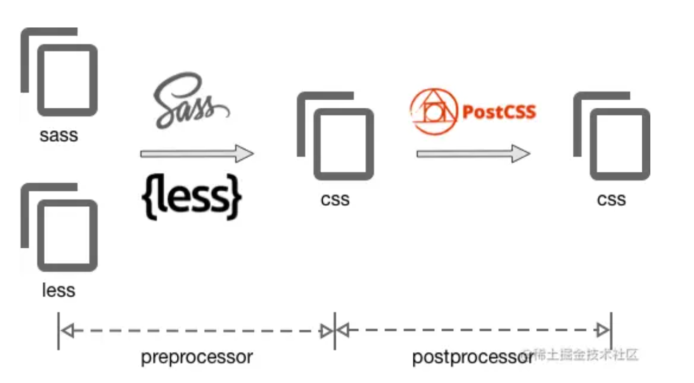

### 7.sourceMap

`sourcemap` 是将编译、打包、压缩后的代码映射回源代码的过程。打包压缩后的代码不具备良好的可读性，想要调试源码就需要 soucremap。map文件只要不打开开发者工具，浏览器是不会加载的。

### 8.热更新HMR

不用刷新浏览器而将新模块替换掉旧模块。目的是为了节省**开发**时间和提高开发效率。

热更新的原理：有
点复杂

拓展：刷新我们一般分为两种：

- 一种是页面刷新，不保留页面状态，就是简单粗暴，直接`window.location.reload()`。
- 另一种是基于`WDS (Webpack-dev-server)`的模块热替换，只需要局部刷新页面上发生变化的模块，同时可以保留当前的页面状态，比如复选框的选中状态、输入框的输入等。