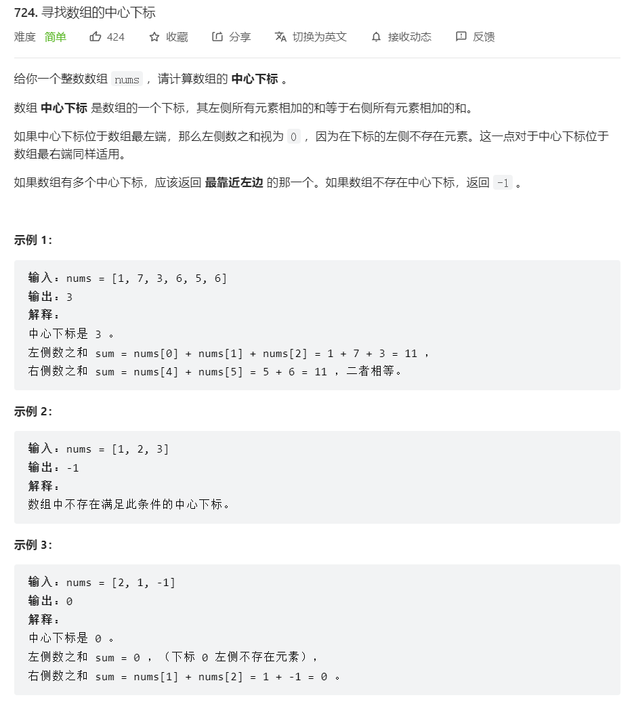
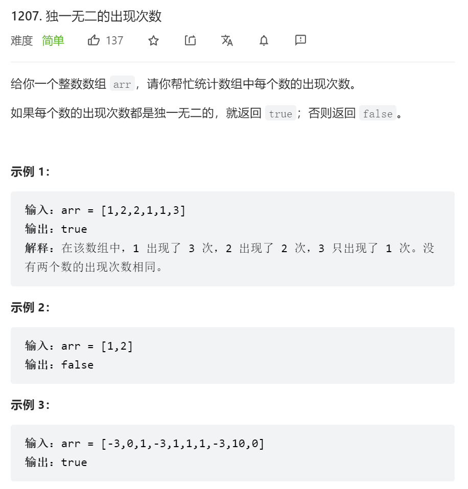

# 数组

## 1.寻找数组中心下标



```js
var pivotIndex = function(nums) {
    let sum = nums.reduce((a, b) => a + b);
    let sumL = 0;// sumL是左侧到中心下标的总和
    let sumR = 0;// 中心下标到最右侧的总和
    for(let i = 0; i < nums.length; i++) {
        sumL += nums[i];
        sumR = sum - sumL + nums[i];// 多减了一个nums[i] 所以要加回来
    }
    return -1;
};
```

## 2.独一无二的出现次数



```js
var uniqueOccurrences = function(arr) {
    let map = new Map();// 利用哈希表来解决
    for(let i = 0; i < arr.length; i++) {
        map.set(arr[i], (map.get(arr[i]) || 0) + 1);// 记录每个数字出现的次数
    }
    return map.size === new Set(map.values()).size;// map记录的元素个数和去了重的map记录的次数对比
};
```

