# 🍔回溯法

## ①✨组合

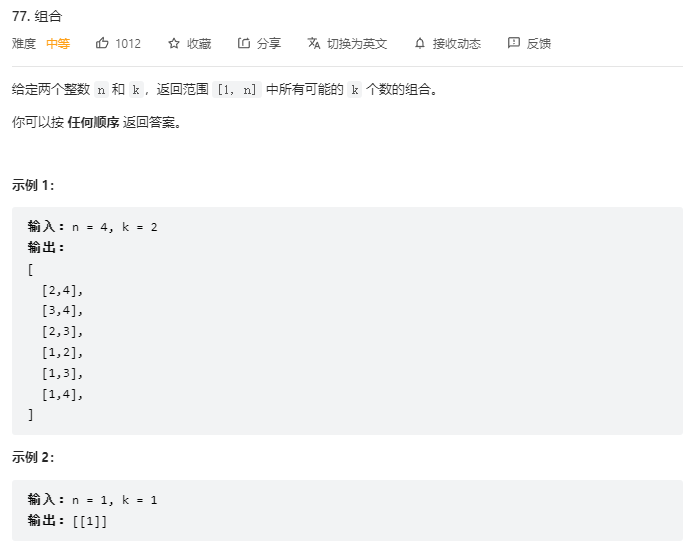

```js
let res = [];// 定义数组保存所有结果
let path = [];// 定义数组保存每一次的路径
var combine = function(n, k) {
    backTrack(n, k, 1);// 开始回溯 1为开始位
    return res;
};
function backTrack(n, k, start) {
    if(path.length === k) {// 如果当前个数等于k
        res.push([...path]);// 把走过的路径加入结果res中，path要变成一个新的引用 所以要解构运算符
        return;// 返回上一层
    }
    for(let i = start; i <= n; i++) {// 每一层进行横向遍历
        path.push(i);// 将每一次遍历的数字加入path中
        backTrack(n, k, i + 1);// 递归遍历 纵向遍历
        path.pop();// 清除上面的操作
    }
}
```

## ②✨组合Ⅲ

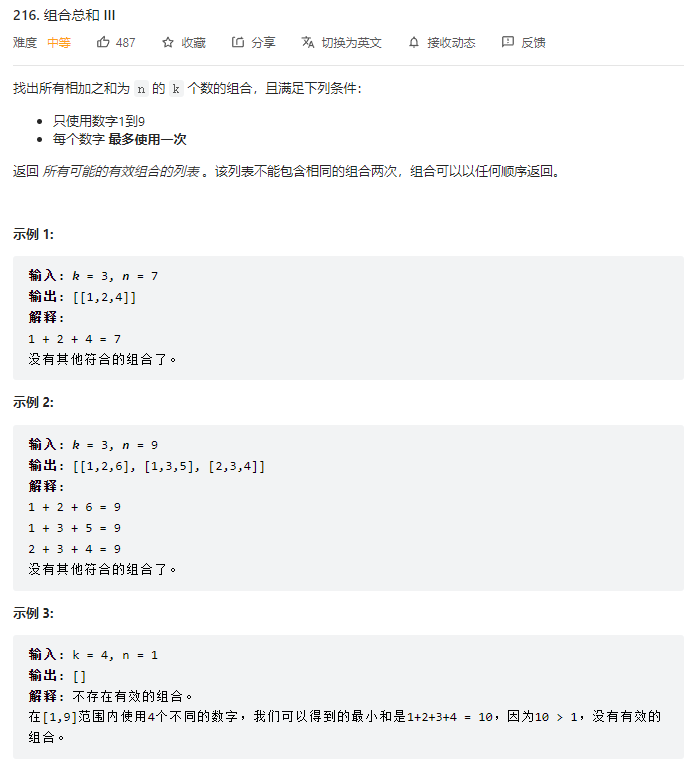

```js
var combinationSum3 = function(k, n) {
    let res = [];// 保存所有结果
    let path = [];// 保存某个符合条件的结果
    function backTrack(sum, start) {// 回溯函数
        if(path.length === k) {
            if(sum === n) res.push([...path]);
            return;
        }
        for(let i = start; i <= 9; i++) {
            sum += i;// sum加i 并把i推进路径中
            path.push(i);
            backTrack(sum, i + 1);// 其实可以直接把sum的操作丢尽函数的参数中
            sum -= i;// 清除上面的操作
            path.pop();
        }
    }
    backTrack(0, 1);
    return res;
};
```

## ③✨电话号码的字母组合

```js
var letterCombinations = function(digits) {
    if(digits === '') return []
    let res = [];// 定义res保存结果
    let map = {// 需要使用map对象把数字和字母作一个映射
        2 : 'abc',
        3 : 'def',
        4 : 'ghi',
        5 : 'jkl',
        6 : 'mno',
        7 : 'pqrs',
        8 : 'tuv',
        9 : 'wxyz'
    }
    function backTrack(str, i) {// str是当前遍历得到的字符串 i用来记录遍历到第几个数字
        if(i === digits.length) {// 由i来进行纵向遍历 出口为i遍历完了传进来的整个数字字符串
            res.push(str);// 添加到结果集
            return;// 返回上一层
        }
        letters = map[digits[i]];// 获取当前遍历到的数字对应的字符串
        for(let s of letters) {// 横向遍历 遍历字符串中的每一个字符
            backTrack(str + s, i + 1);// 纵向遍历 拼接字符串，并且digits的下标加1 遍历下一个字符串
        }
    }
    backTrack('', 0);
    return res;
};
```

## ④✨全排列

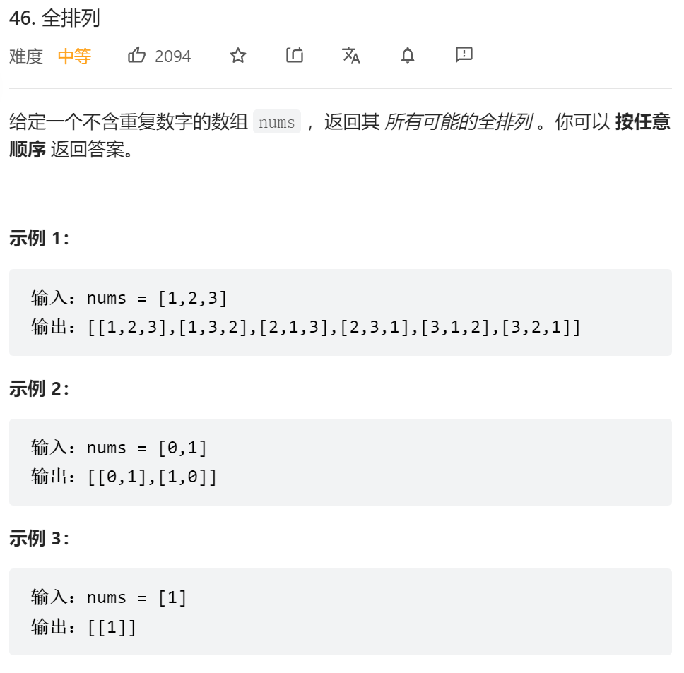

```js
var permute = function(nums) {
    let res = [];// 保存结果
    let path = [];// 保存每次的排列
    let n = nums.length;
    let used = [];// 记录数字是否被使用了，避免数字重复使用
    backTrack(nums);// 对nums进行回溯
    return res;// 返回结果
    function backTrack() {
        if(nums.length === path.length) {// 当前排列长度等于数组长度
            res.push([...path]);// 将path深拷贝给res
            return;// 返回上一层
        }
        for(let i = 0; i < n; i++) {// 横向遍历
            if(used[i]) continue;// 数字使用过就跳过
            used[i] = true;// 对使用过的数字进行标记
            path.push(nums[i]);// 把当前数字存入path
            backTrack(nums);// 纵向遍历 调用backTrack
            path.pop();// 清空上面的操作
            used[i] = false; 
        }
    }
};
```

## ⑤✨全排列Ⅱ

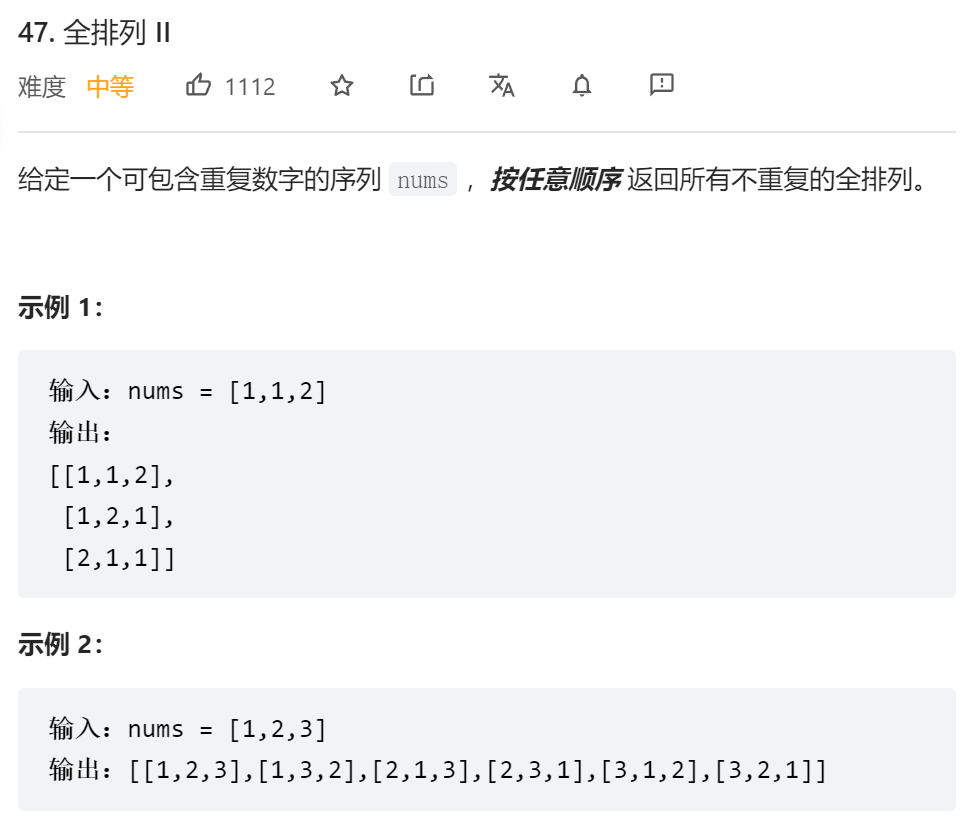

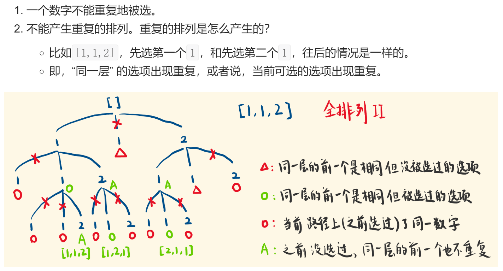

```js
var permuteUnique = function(nums) {
    nums.sort((a, b) => a - b);// 先进行排序 为之后去重作准备
    let res = [];
    let path = [];
    let used = [];
    backTrack(nums);
    return res;
    function backTrack(nums) {
        if(nums.length === path.length) {
            res.push([...path]);
            return;
        }
        for(let i = 0; i < nums.length; i++) {
            // used[i]为true说明当前路径该数字被使用过 used[i-1]同一层相同且未被使用
            if(used[i] || i > 0 && nums[i] == nums[i - 1] && !used[i - 1]) continue;
            used[i] = true;
            path.push(nums[i]);
            backTrack(nums);
            path.pop();
            used[i] = false;
        }
    }
};
```

## ⑥✨递增子序列

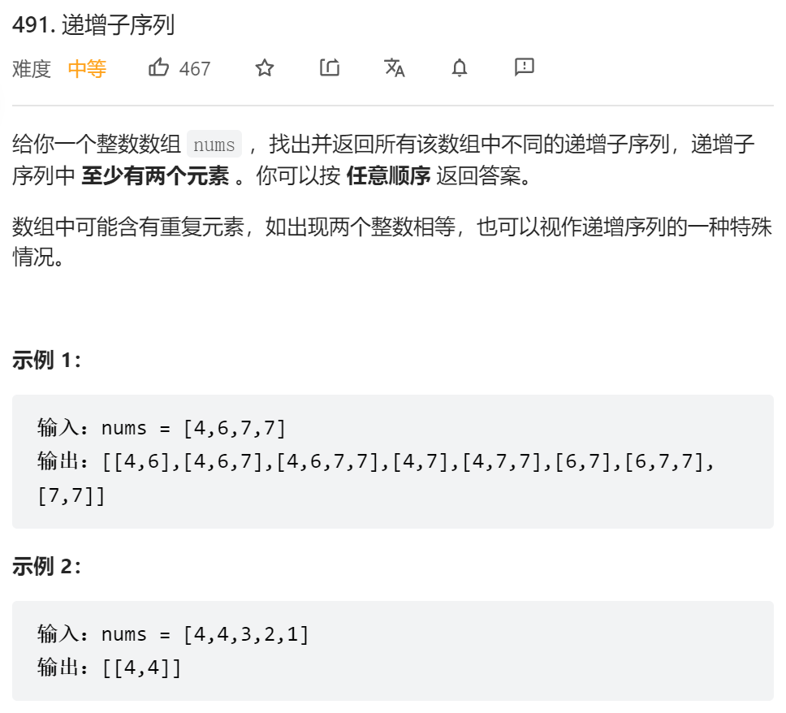

```js
var findSubsequences = function(nums) {
    let res = [];
    let path = [];
    backTrack(0);
    return res;
    function backTrack(start) {
        if(path.length >= 2) {
            res.push([...path]);
        }
        let set = new Set();
        for(let i = start; i < nums.length; i++) {
            // 同一层出现重复数字或当前数字小于路径path保存的最后一个（即不是递增）则跳过
            if(set.has(nums[i]) || nums[i] < path[path.length - 1]) continue;
            set.add(nums[i]);
            path.push(nums[i]);
            backTrack(i + 1);
            path.pop();
        }
    }
};
```

## ⑦✨子集

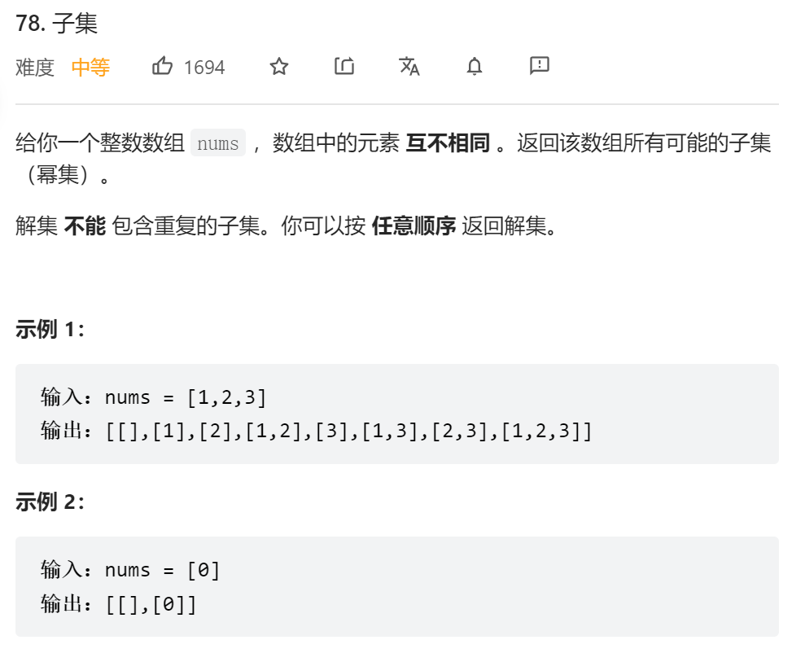

```js
var subsets = function(nums) {
    let res = [];
    let path = [];
    backTrack(0);
    return res;
    function backTrack(start) {
        res.push([...path]);
        for(let i = start; i < nums.length; i++) {
            path.push(nums[i]);
            backTrack(i + 1);
            path.pop();
        }
    }
};
```

## ⑧✨子集Ⅱ

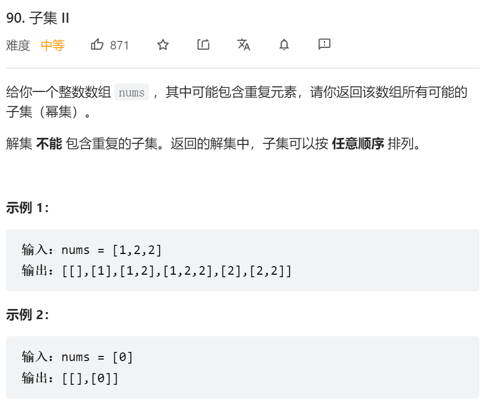

```js
var subsetsWithDup = function(nums) {
    nums.sort((a, b) => a - b);
    let res = [];
    let path = [];
    backTrack(0);
    return res;
    function backTrack(start) {
        res.push([...path]);
        let set = new Set();
        for(let i = start; i < nums.length; i++) {
            if(set.has(nums[i])) continue;
            set.add(nums[i]);
            path.push(nums[i]);
            backTrack(i + 1);
            path.pop();
        }
    }
};
```

## ⑨✨组合总和 

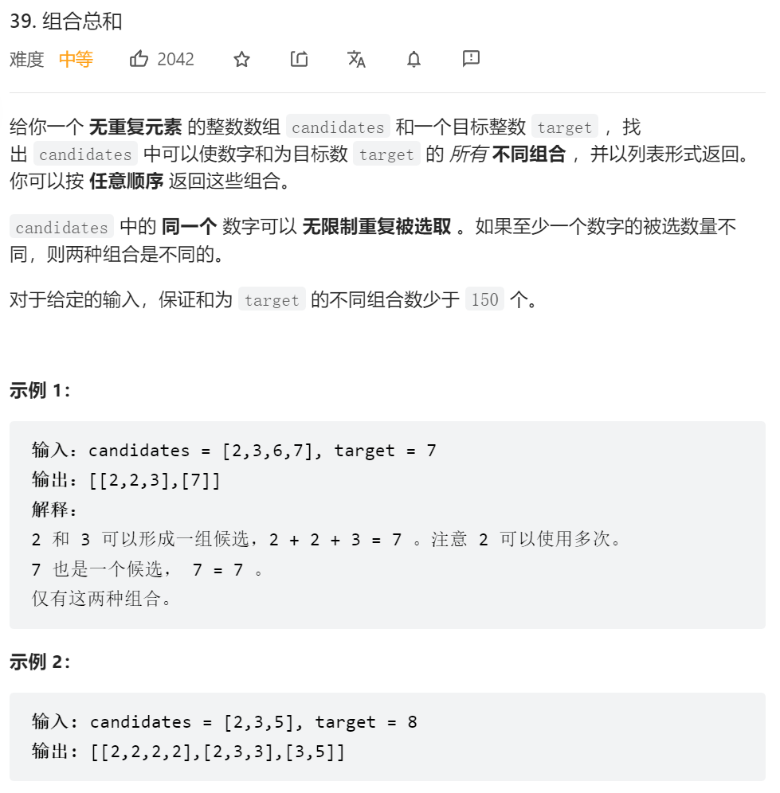

```js
var combinationSum = function(candidates, target) {
    let res = [];
    let path = [];
    backTrack(0, target);
    return res;
    function backTrack(start, target) {
        if(target < 0) return;
        if(target === 0) {
            res.push([...path]);
            return;
        }
        for(let i = start; i < candidates.length; i++) {
            path.push(candidates[i]);
            backTrack(i, target - candidates[i]);// i-->可以重复使用自身
            path.pop();
        }
    }
};
```

## ⑩✨组合总和

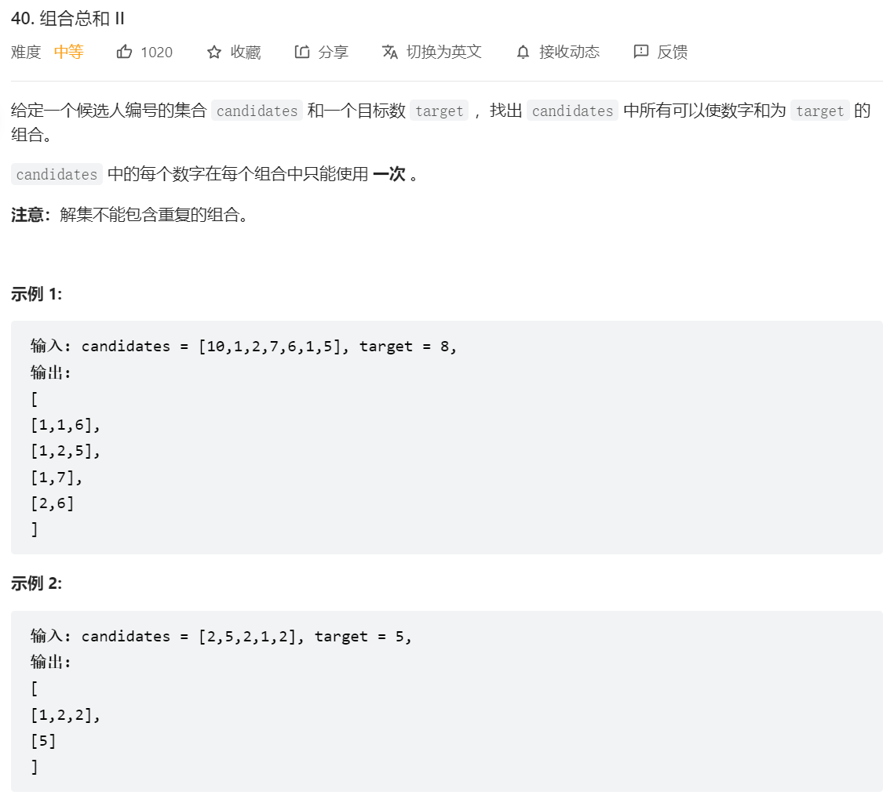

```js
var combinationSum2 = function(candidates, target) {
    candidates.sort((a, b) => a - b);
    let res = [];
    let path = [];
    backTrack(target, 0);
    return res;
    function backTrack(target, start) {
        if(target < 0) return;
        if(target === 0) {
            res.push([...path]);
            return;
        }
        let set = new Set();// 去除同一层的相同元素
        for(let i = start; i < candidates.length; i++) {
            if(set.has(candidates[i])) continue;
            set.add(candidates[i]);
            path.push(candidates[i]);
            backTrack(target - candidates[i], i + 1);
            path.pop();
        }
    }
};
```

## 11.✨电话号码的字母组合

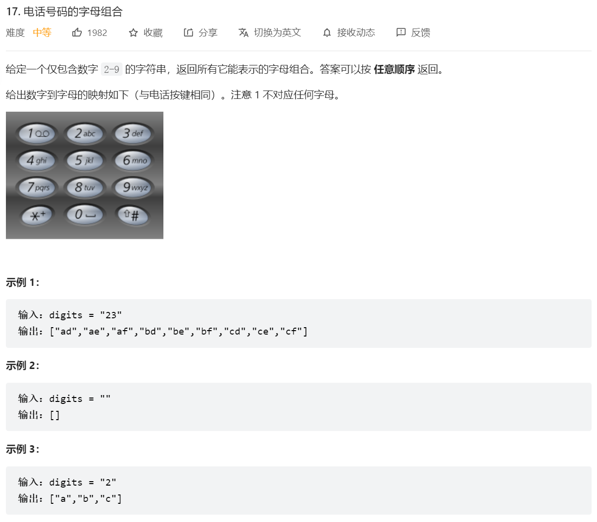

```js
var letterCombinations = function(digits) {
    if(digits === '') return []
    let res = [];// 定义res保存结果
    let map = {// 需要使用map对象把数字和字母作一个映射
        2 : 'abc',
        3 : 'def',
        4 : 'ghi',
        5 : 'jkl',
        6 : 'mno',
        7 : 'pqrs',
        8 : 'tuv',
        9 : 'wxyz'
    }
    function backTrack(str, i) {// str是当前遍历得到的字符串 i用来记录遍历到第几个数字
        if(i === digits.length) {// 由i来进行纵向遍历 出口为i遍历完了传进来的整个数字字符串
            res.push(str);// 添加到结果集
            return;// 返回上一层
        }
        letters = map[digits[i]];// 获取当前遍历到的数字对应的字符串
        for(let s of letters) {// 横向遍历 遍历字符串中的每一个字符
            backTrack(str + s, i + 1);// 纵向遍历 拼接字符串，并且digits的下标加1 遍历下一个字符串
        }
    }
    backTrack('', 0);
    return res;
};
```

