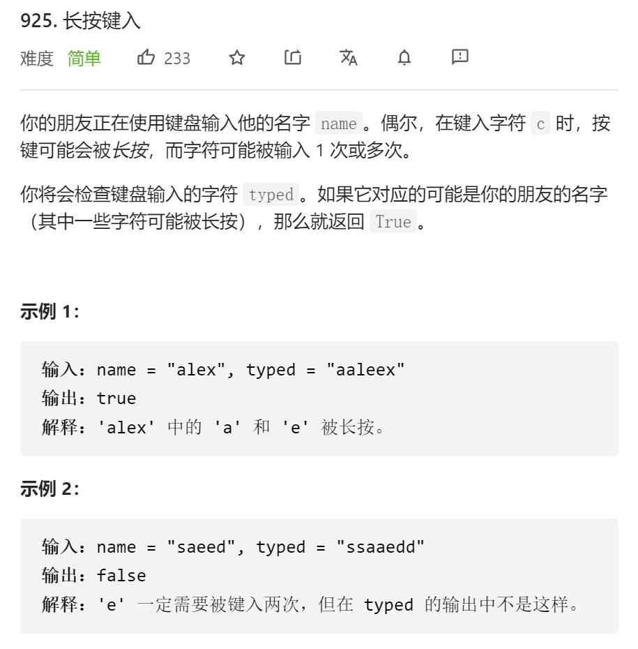
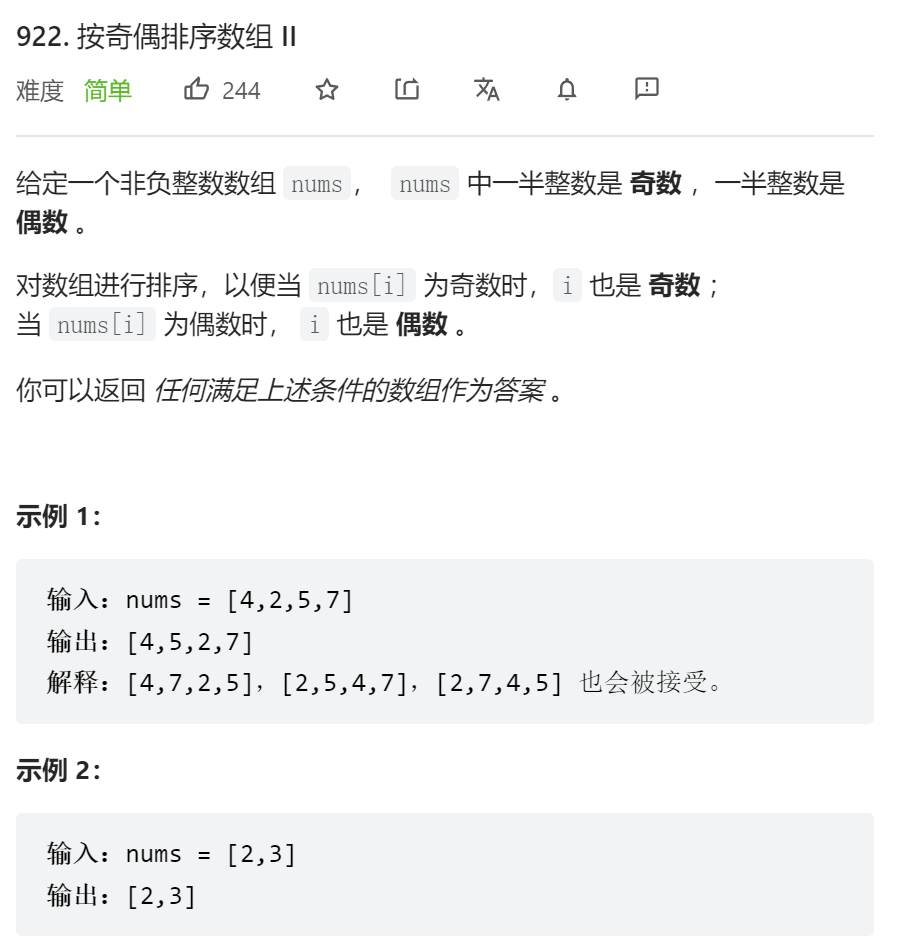
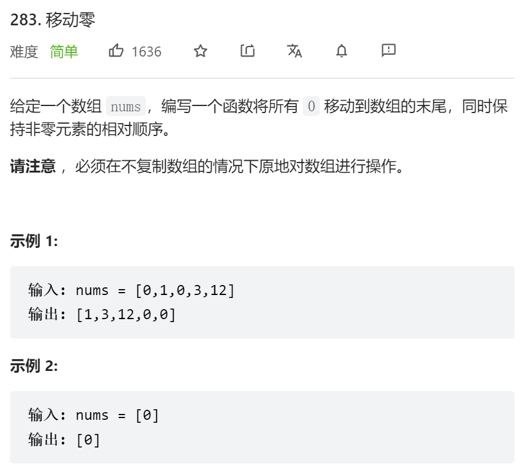
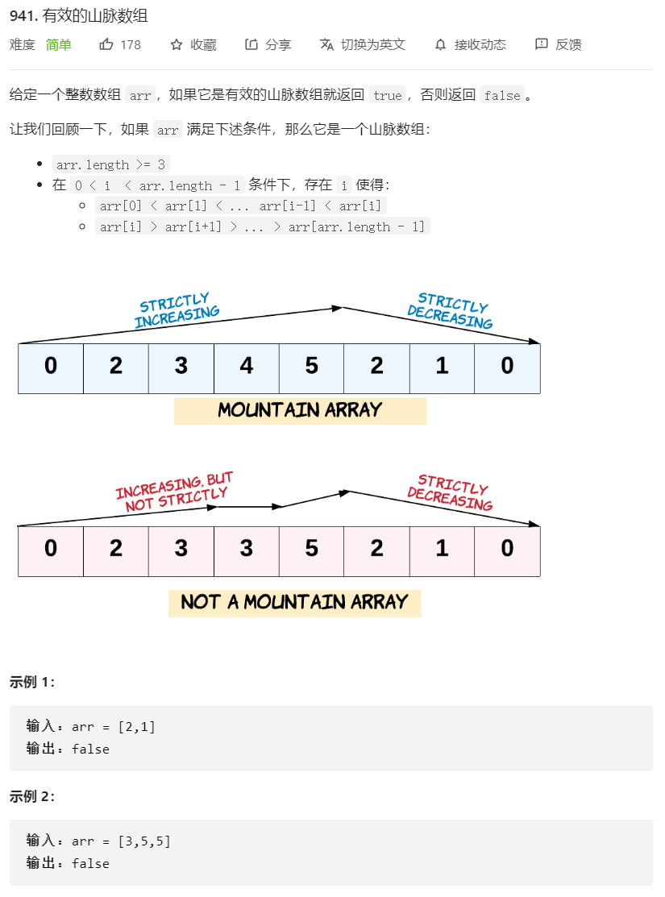

# 🎁双指针

## 1.🎍长按键入



```js
var isLongPressedName = function(name, typed) {
    let i = 0;
    let j = 0;
    while(j < typed.length) {// 循环遍历 
        if(name[i] === typed[j]) {// 如果name和type当前位置的元素一样 则同时前移
            i++;
            j++;
        } else {// 如果不一样
            if(typed[j] === typed[j - 1]) {// 判断type的当前元素是否和它自身的前一个是否一样
                j++;// 一样则j前移
            } else {// 不一样说明不是长按
                return false;
            }
        }
    }
    return name[i] === typed[j];// 结果还要对比name和typed的最后一个元素是否一致
};
```

## 2.🎍按奇偶排序数组 II



```js
var sortArrayByParityII = function(nums) {
    let res = [];// 创建一个数组保存结果
    let even = 0;
    let odd = 1;
    nums.forEach((item) => {
        if(item % 2 === 0) {// 奇数存进奇数奇数下标
            res[even] =  item;
            even = even + 2;// 奇数指针+2
        }else {// 偶数存进偶数下标
            res[odd] = item;
            odd = odd + 2;// 偶数下标+2
        }
    })
    return res;
};
```

## 3.🎍移动零



```js
var moveZeroes = function(nums) {
    let l = 0;// 双指针 l记录0的位置
    let r = 0;
    while(r < nums.length) {
        if(nums[r] === 0) {// 当前值如果等于0 则l不动 r前移
            r++;
        } else {// 如果不等于0 
            nums[l] = nums[r];// 将当前值nums[r]存到l的位置 l,r同时前移
            l++;
            r++;
        }
    }
    for(let i = l; i < nums.length; i++) {// 把剩下的全置为0
        nums[i] = 0;
    }
    return nums;
};
```

## 4.🎍有效的山脉数组



```js
var validMountainArray = function(arr) {
    if(arr.length < 3) return false;
    let n = arr.length;
    let l = 0;
    let r = arr.length - 1;
    while(l < n && arr[l + 1] > arr[l]) l++;// 左边爬坡
    while(r > 0 && arr[r - 1] > arr[r]) r--;// 右边爬坡
    if(l === r && l != 0 && r != n - 1) return true;
    else return false;
};
```

