# 贪心算法

## 一、😶分发饼干

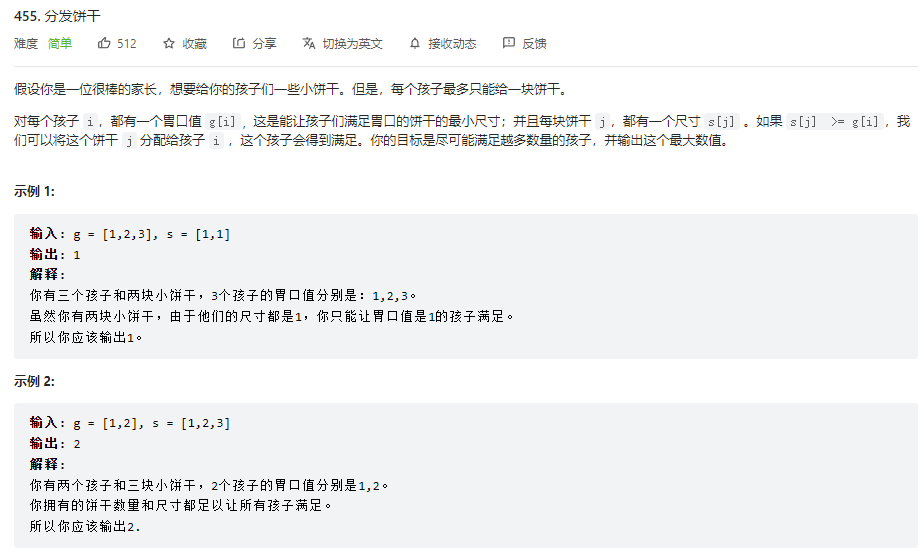

```js
var findContentChildren = function(g, s) {
    g.sort((a, b) => a - b);//对两个数组进行排序
    s.sort((a, b) => a - b);
    let res = 0;//能满足的人数
    let index = 0;//人数下标
    for(let i = 0; i < s.length; i++) {//遍历饼干数组
    //当前遍历人数不超出总人数且饼干能满足小孩胃口 则res++ 轮到下一个小孩index++
        if(index < g.length && s[i] >= g[index]){
            res++;
            index++;
        }
    }
    return res;
};
```

```java
class Solution {
    public int findContentChildren(int[] g, int[] s) {
        Arrays.sort(g);//对两者进行排序
        Arrays.sort(s);
        int res = 0;//能满足的人数
        int index = 0;//标记每一个人
        for(int i = 0; i < s.length; i++){//遍历饼干----也可以换成先遍历人 要倒过来遍历
            //找到胃口小于等于饼干的 就记录一次res++ 并换另一个小孩 index++
            if(index < g.length && g[index] <= s[i]){
                res++;
                index++;
            }          
        }
        return res;
    }
}
```

## 二、😶摆动序列

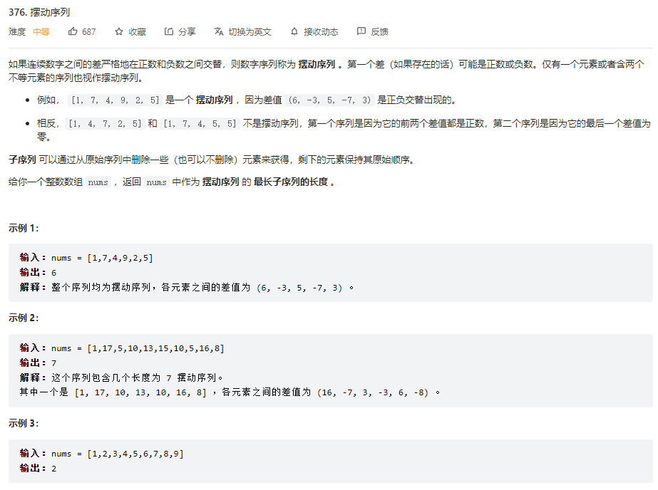

```js
//动态规划
var wiggleMaxLength = function(nums) {
    let max = 1;
    let n = nums.length;
    let up = Array(n).fill(1);
    let down = Array(n).fill(1);
    for(let i = 1; i < n; i++) {
        if(nums[i] > nums[i - 1]) {//当前为升序
            up[i] = down[i - 1] + 1;// 则由前一个降序长度+1
            down[i] = down[i - 1];//当前降序长度不变
        }else if(nums[i] < nums[i - 1]) {
            down[i] = up[i - 1] + 1;
            up[i] = up[i - 1];
        }else {//若为平坡
            up[i] = up[i - 1];//则升序长度和降序长度均不变
            down[i] = down[i - 1];
        }
        max = Math.max(max, up[i], down[i]);//取最大值
    }
    return max;
};
```


```java
class Solution {
    public int wiggleMaxLength(int[] nums) {
        if(nums.length < 2) return nums.length;//如果长度为1 则返回当前长度
        int res = 1;//摆动序列最长子序列的长度 res至少为1
        int curDiff = 0;//当前两个数的差值
        int preDiff = 0;//一开始为0 后面被赋值为curDiff
        for(int i = 1 ; i < nums.length; i++){
            curDiff = nums[i] - nums[i - 1];
            //如果当前差值和前一个差值异号则 res++ preDiff置为当前差值
            //为什么会有等于0 因为一开始preDiff设置为0了
            if((curDiff > 0 && preDiff <= 0) || (curDiff < 0 && preDiff >= 0)){
                res++;//若出现异号则记录一次
                preDiff = curDiff;//前一个差值赋值为当前差值
            }
        }
        return res;
    }
}
```

## 三、😀最长湍流子数组

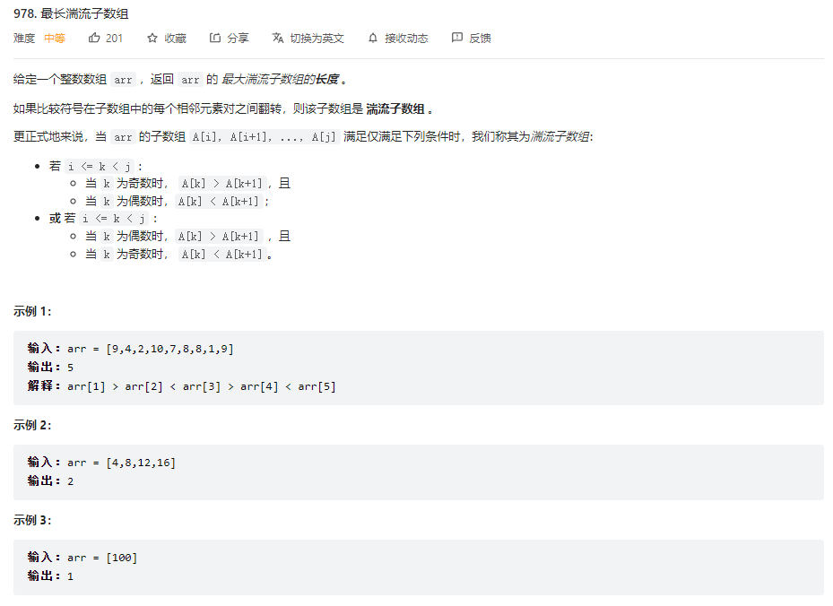

```JS
var maxTurbulenceSize = function(arr) {
    // 动态规划：
    // up[i]：当前趋势为升序的子数组长度
    // down[i]: 当前趋势为降序的组数组长度
    // 初始值均为1
    // 由arr[i] - arr[i - 1]来判断当前趋势
    // 降序趋势的长度由前一个升序趋势的长度来决定
    let n = arr.length;
    let up = Array(n).fill(1);
    let down = Array(n).fill(1);
    let max = 1;
    for(let i = 1; i < arr.length; i++) {
        if(arr[i] > arr[i - 1]) {
            up[i] = down[i - 1] + 1;
            // down[i] = 1;
        }else if(arr[i] < arr[i - 1]) {
            down[i] = up[i - 1] + 1;
            // up[i] = 1;
        }
        max = Math.max(max, up[i], down[i]);
    }
    return max;
};
```


```java
class Solution {
    public int maxTurbulenceSize(int[] arr) {
        int maxLength = 1;
        int max = 1;
        int n = arr.length;
        int[] up = new int[n];
        int[] down = new int[n];
        Arrays.fill(up, 1);
        Arrays.fill(down, 1);
        for(int i = 1; i < n; i++){
            if(arr[i] > arr[i - 1]){//当前为升序趋势
                up[i] = down[i - 1] + 1;//升序长度 = 前面降序长度+1
            }else if(arr[i] < arr[i - 1]){//当前为降序趋势
                down[i] = up[i - 1] + 1;//降序长度 = 前面升序长度+1
            }
            //等于不更新当前数组 因为本来就是默认为1
            max = Math.max(max, Math.max(up[i], down[i]));
        }
        return max;
    }
}
```

## 四、🙄最大子数组和

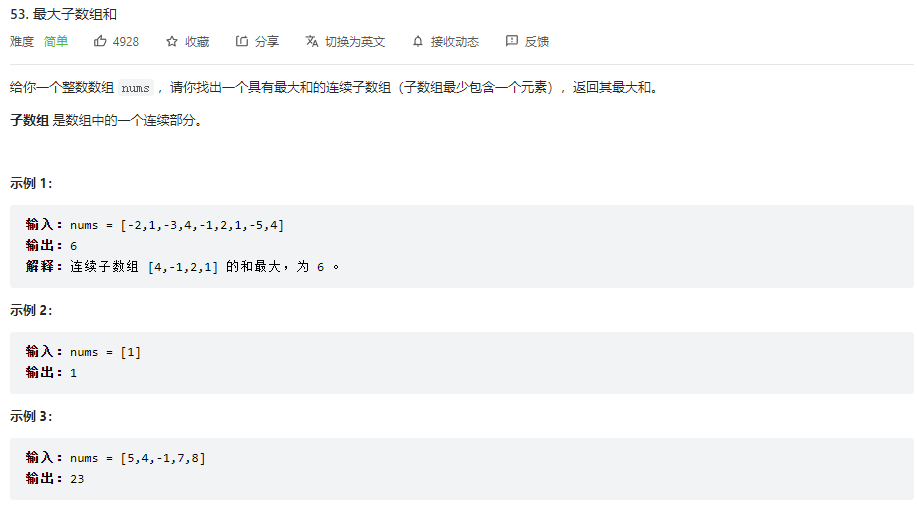

```js
var maxSubArray = function(nums) {
    let max = nums[0];
    let sum = 0;
    for(let num of nums) {
        sum = Math.max(sum + num, num);//比较当前连续子数组和与当前元素的大小 若小于则弃掉前面的
        max = Math.max(sum, max);//记录连续子数组和最大值
    }
    return max;
};
```

```js
var maxSubArray = function(nums) {
    //dp动态规划
    let dp = [];
    dp[0] = nums[0];
    let max = nums[0];
    for(let i = 1; i < nums.length; i++) {
        dp[i] = Math.max(dp[i - 1] + nums[i], nums[i]);
        max = Math.max(dp[i], max);
    }
    return max;
};
```

## 五、🙄买卖股票的最佳时机系列

### 5.1买卖股票的最佳时机Ⅰ

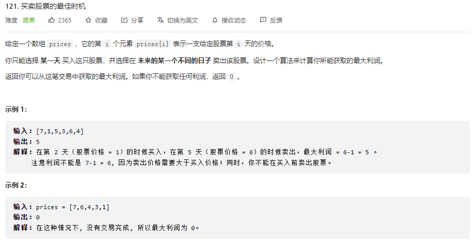

```js
var maxProfit = function(prices) {
    let min = prices[0];
    let max = 0;
    for(let price of prices) {
        min = Math.min(price, min);
        max = Math.max(price - min, max);
    }
    return max;
};
```

## 六、😉跳跃游戏系列

### 6.1跳跃游戏Ⅰ

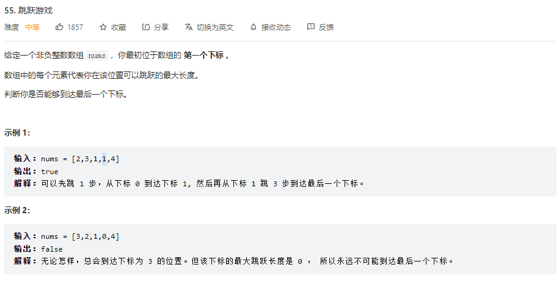

```js
var canJump = function(nums) {
    let maxCover = 0;
    for(let i = 0; i <= maxCover; i++) {//每次跳跃选择最大步数
        maxCover = Math.max(nums[i] + i, maxCover);//每次遍历更新覆盖范围
        if(maxCover >= nums.length - 1) {//覆盖范围超出或刚好等于数组长度则可以跳到最后
            return true;
        }
    }
    return false;
};
```

### 6.2跳跃游戏Ⅱ

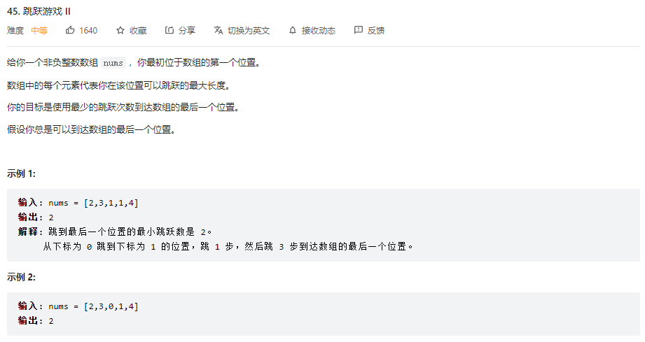

```js
var jump = function(nums) {
    let n = nums.length;
    let currentEdg = 0;//当前跳跃的最大范围/边界
    let nextEdg = 0;// 下一跳的最大范围
    let step = 0;//记录步数
    for(let i = 0; i < n - 1; i++) {// i<n-1 是因为最后一个位置不需要再跳了 已经到达终点
        nextEdg = Math.max(i + nums[i], nextEdg);// 更新下一跳的最大范围
        // 如果当前遍历已经达到本次跳跃最大范围 必须跳一下了 当然并不是必定在i的位置跳,必须在这范围内跳而已
        if(i === currentEdg) {
            currentEdg = nextEdg;//当前边界更新为下一个边界
            step++;
        }
    }
    return step;
};
```

## 七、😀k次取反后最大化的数组和

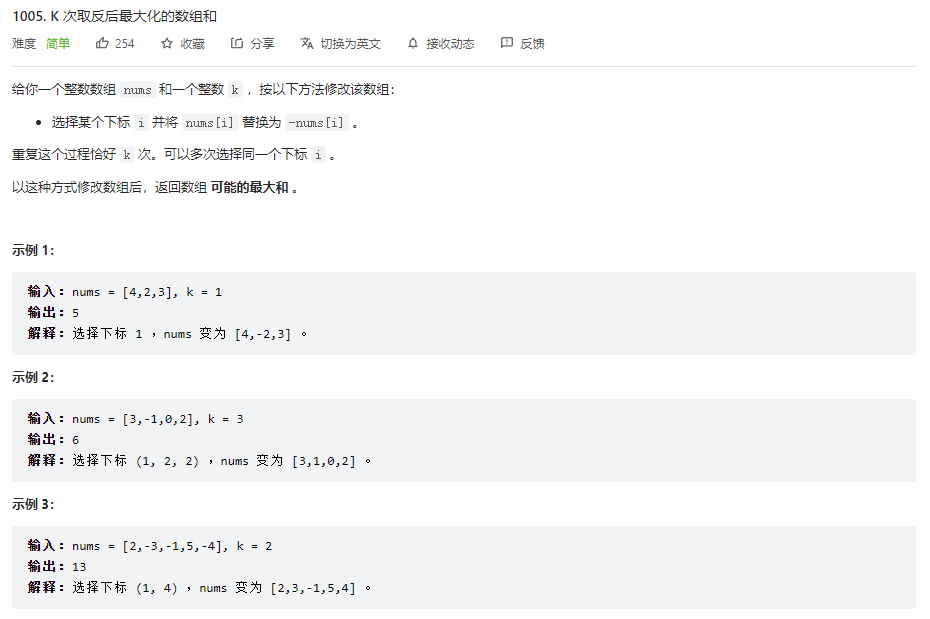

```js
// nums可能全为正数 全为负数 或者正负都有
// 思路：
// 把负数都变为正数 若有剩余次数
// 则判断剩余次数 奇数：把绝对值最小的变负 偶数：直接抵消 不变
var largestSumAfterKNegations = function(nums, k) {
    nums.sort((a, b) => a - b);// 数组正序排列
    let index = 0;// 定义一个索引
    while(nums[index] < 0 && k > 0) {// 当前元素为负而且k次数也大于零
        nums[index] = -nums[index];// 则把负数转化为正数
        index++;// 索引加一
        k--;// k的次数减一
    }
    if(k > 0 && k % 2 != 0) {// k还有剩余而且剩余次数为奇数
        let min;// 定义最小值的下标索引
        if(index == nums.length) min = index - 1;// 全为负数 index刚好超出数组范围
        else if(index ==  0) min = index;// 全为整数 最小值小标为开始的0下标
        else min = nums[index] > nums[index - 1] ? index - 1 : index// 有正有负 判断index和它前面的哪个小 就把哪个修改为负
        nums[min] = -nums[min];
    }
    return nums.reduce((a, b) => a + b);// 处理完各种情况 直接求和并返回
};
```

## 八、😂分发糖果

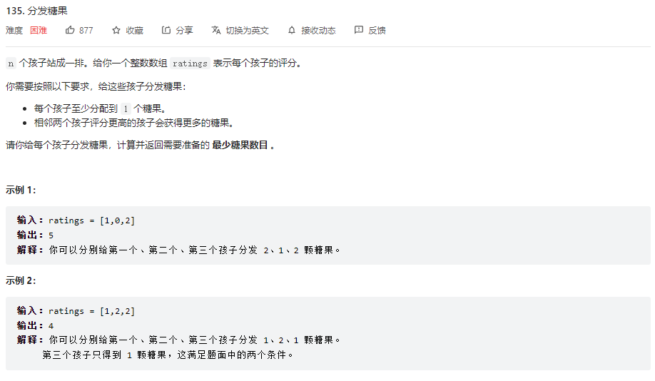

```js
var candy = function(ratings) {
    let n = ratings.length;// 定义评分数组长度
    let candyCount = Array(n).fill(1);// 创建数组并设初始值为1
    for(let i = 1; i < n; i++) {// 从左开始遍历数组 
        if(ratings[i] > ratings[i - 1]) {// 后一个评分比前一个评分高 相反则保持1
            candyCount[i] = candyCount[i - 1] + 1;// 则后一个比前一个+1
        }
    }
    for(let i = n - 1; i > 0; i--) {// 从右往左遍历数组
        if(ratings[i] < ratings[i - 1]) {// 前一个比后一个平凡高的 必须要拿更多糖果 要么保持自己原来有的 要么比后一个多1 两者取最大，因为还要比它之前的多
            candyCount[i - 1] = Math.max(candyCount[i - 1], candyCount[i] + 1);
        }
    }
    return candyCount.reduce((a, b) => a + b);
};
```

## 九、😐根据身高重建队列

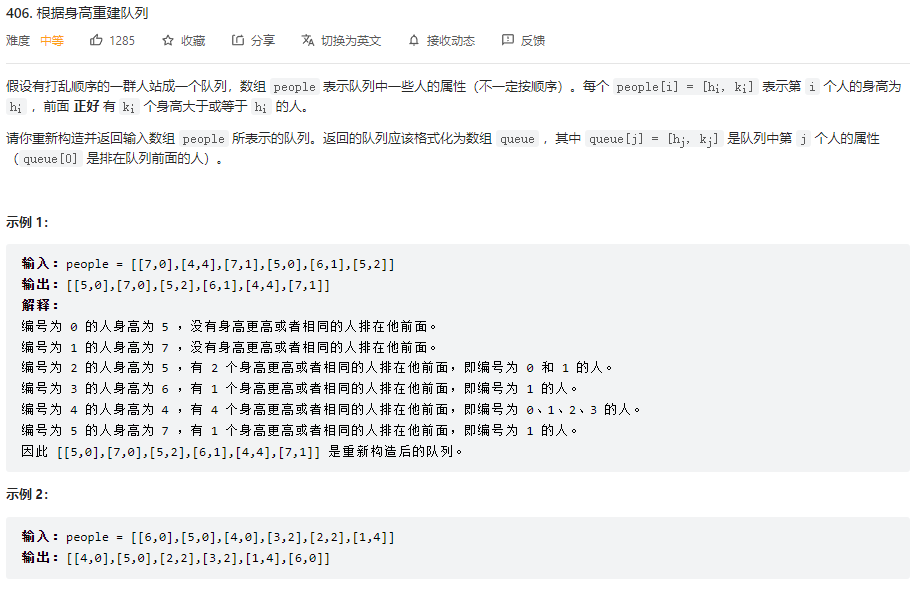

> 先按身高从大到小排列

排序完的people： [[7,0], [7,1], [6,1], [5,0], [5,2]，[4,4]]

插入的过程：

- 插入[7,0]：[[7,0]]
- 插入[7,1]：[[7,0],[7,1]]
- 插入[6,1]：[[7,0],[6,1],[7,1]]
- 插入[5,0]：[[5,0],[7,0],[6,1],[7,1]]
- 插入[5,2]：[[5,0],[7,0],[5,2],[6,1],[7,1]]
- 插入[4,4]：[[5,0],[7,0],[5,2],[6,1],[4,4],[7,1]]

```js
var reconstructQueue = function(people) {
    let n = people.length;
    // 对身高进行排序 由高到低 设数组people[i] = [hi, ki]
    for(let i = 0; i < n; i++) {
        people.sort((a, b) => {// 对数组people排序
            if(a[0] === b[0]){// 如果身高相等
                return a[1] - b[1]// 根据ki来排序 以ki进行正序排列
            }else {// 若身高不等
                return b[0] - a[0]// 根据身高来排序 这里是逆序 即由大到小
            }
        })
    }
    let queue = [];
    // 根据ki值依次把每一个人插入相应位置
    for(let i = 0; i < n; i++) {
        queue.splice(people[i][1], 0, people[i])
    }
    return queue;
};
```

## 十、😉用最少数量的箭引爆气球

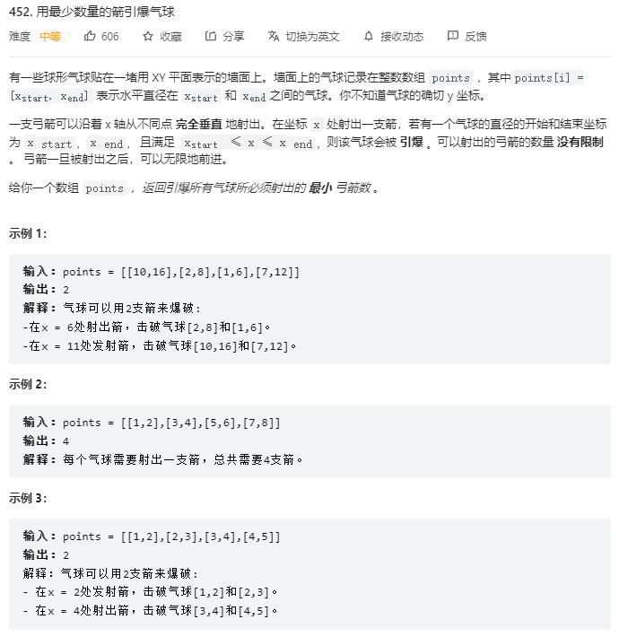

```js
var findMinArrowShots = function(points) {
    let n = points.length;
    let count = 1;// 由于遍历是从第二个气球开始的 所以一开始先射一箭
    points.sort((a, b) => a[0] - b[0]);// 按照左边界将二维数组排序
    for(let i = 1; i < n; i++) {// 遍历二维数组 由第二个开始遍历
        // 当前气球左边界大于前一个气球的右边界 则必须要射箭了
        if(points[i][0] > points[i - 1][1]) {
            count++;
        }else {// 小于的话 则把当前的有边界更新成最小右边界
            points[i][1] = Math.min(points[i][1], points[i - 1][1]);
        }
    }
    return count;
};
```

## 十一、😁合并区间

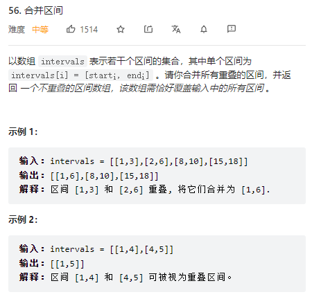

```js
var merge = function(intervals) {
    let res = [];// 定义一个数组保存不重复区间
    let n = intervals.length;
    intervals.sort((a, b) => a[0] - b[0]);// 对二维数组按照start来进行排序
    let pre = intervals[0];// pre拿到第一个区间
    for(let i = 0; i < intervals.length; i++) {// 遍历区间
        let cur = intervals[i];// 获取当前区间
        if(pre[1] >= cur[0]) {// 如果前一区间的右边界大于等于当前区间，则修改前一区间的右边界
            pre[1] = Math.max(pre[1], cur[1]);// 去前一区间的右边界或者当前区间的右边的最大值，这就是合并
        }else {// 若当前区间左边界不在前一区间中
            res.push(pre);// 则将pre区间加入res中
            pre = cur;// 并修改前一区间为当前区间 向前推进
        }
    }
    res.push(pre);// 因为最后一个区间无法再比较了 所以找不到与之重合的区间 要在结果res中补上
    return res;
};
```

## 十二、😜单调递增的数字

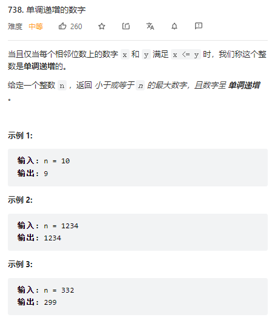

```js
var monotoneIncreasingDigits = function(N) {
    var s=N.toString().split("");// 将数字变为字符串再转换为数组
    for(let i=0;i<s.length-1;i++){// 对字符串数组进行遍历
        if(s[i]>s[i+1]){// 如果当前数字大于后一个
            s[i]--;// 当前数字降一位
            for(let j=i+1;j<s.length;j++) s[j]="9";// 后面全部变为9
            i=-1;// 保证新的一轮遍历中i还是从0开始
        }
    }
    return parseInt(s.join("")) 
};
```

