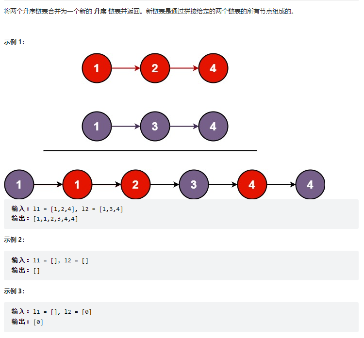
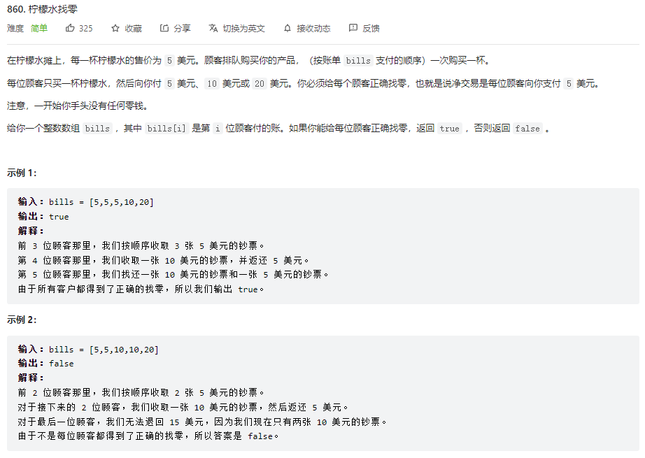
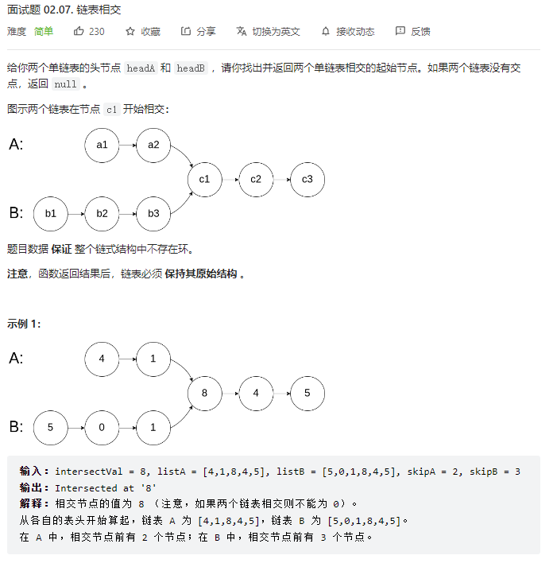
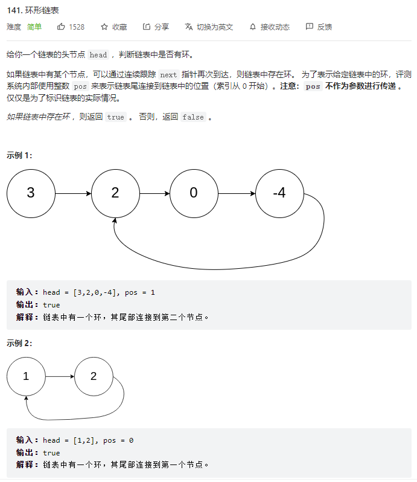
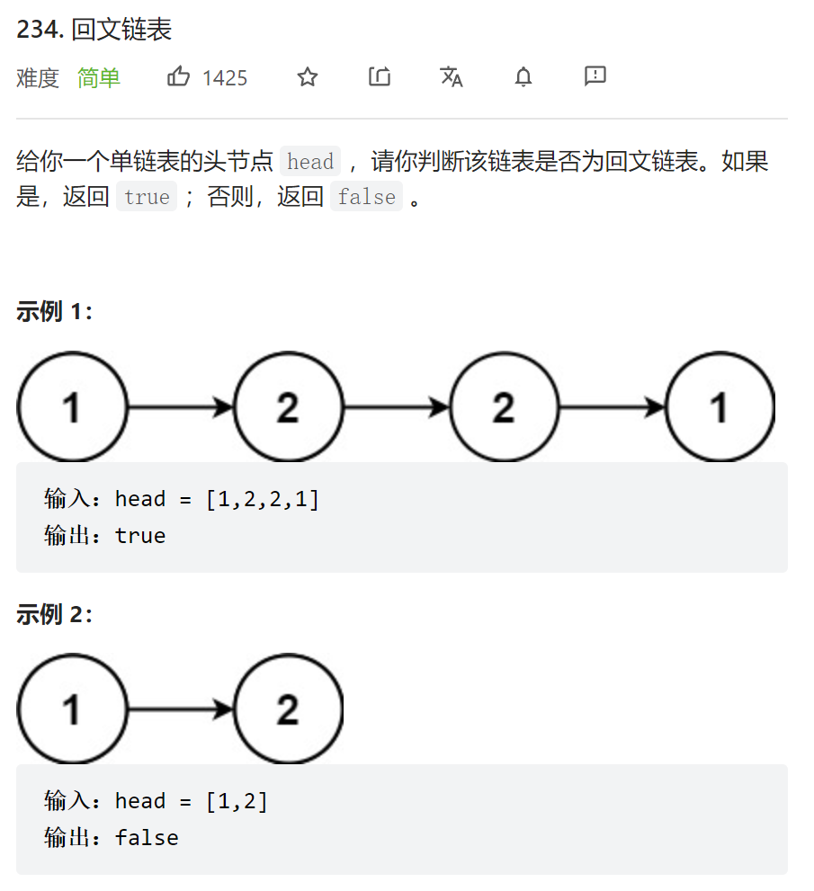
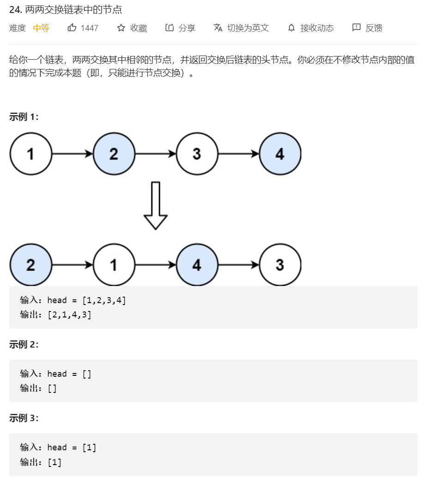

# 🍔链表

## ① 🏸合并两个有序链表



```js
var mergeTwoLists = function(list1, list2) {
    let dummy = new ListNode();// 定义空结点dummy 
    let p = dummy;// p 指向 dummy 
    while(list1 && list2) {// 若list1和list2都不等于空 进入循环
        if(list1.val <= list2.val) {// 当list1的元素小于等于list2
            p.next = list1;// 则p.next指针指向list1
            list1 = list1.next;// list1指向它的下一个节点 以便比较下一位和list2的大小
        }else {// 若大于
            p.next = list2;// 则p的nxet指针指向list2
            list2 = list2.next;// list2也往前移一位
        }
        p = p.next;// p也前进一位即指向它的next
    }
    // p必定指向最早被遍历完的链表的表尾
    p.next = list1 === null ? list2 : list1;// 判断list1是否为空 空则p.next指向list2 反之指向list1
    return dummy.next;
};
```

## ② 🏸柠檬水找零



```js
var lemonadeChange = function(bills) {
    let five = 0, ten = 0; // 记录5块，10块的美金的数量 只有5块和10块才可以当作零钱找零
    let n = bills.length;
    for(let i = 0; i < n; i++) {
        if(bills[i] === 5) {// 若进账5块 啥也不用干 直接增加five的数量
            five++;
        }else if(bills[i] === 10) {// 若进账10块 则需要一张5块找零 five--
            if(five <= 0) return false;
            five--;// 5块小猴一张
            ten++;// 10块进账一张
        }else{// 若进账20块 则进行两种情况的找零
            if(ten > 0 && five > 0) {// 优先消耗手中的一张10块，在消耗一张5块
                ten--;
                five--;
            }else if(five >= 3) {// 当5块的数量大于等于3 才可以找零
                five = five - 3;
            }else {// 属于是没零钱可以找了
                return false;
            }
        }
    }
    return true;
};
```

## ③ 🏸链表相交



```js
 // A链表走完再走B链表 B链表走完再走A链表，若相交必相遇
var getIntersectionNode = function(headA, headB) {
    let A = headA;
    let B = headB;
    while(A != B) {
        A = A ? A.next : headB;// A若不为空则指向A.next，若为空则指向headB B同理
        B = B ? B.next : headA;
    }
    return A;
};
```

## ④ 🏸环形链表



```js
var hasCycle = function(head) {
    let slow = head;// 设置快慢指针
    let fast = head;
    while(true) {
        if(fast == null || fast.next == null) return false;// fast指针遍历到表尾了 所有无环
        slow = slow.next;
        fast = fast.next.next;
        if(fast === slow) return true;// 相遇则说明成环
    }
};
```

## ④ 🏸回文链表



```js
var isPalindrome = function(head) {
    let nums = [];// 创建一个数组保存链表值
    while(head) {// 遍历链表
        nums.push(head.val)// 将链表值存入nums数组
        head = head.next;
    }
    for(let i = 0; i < nums.length / 2; i++) {// 遍历数组  也可以用双指针遍历
        if(nums[i] != nums[nums.length - 1 - i]) return false;// 判断头尾值是否相等 不等返回false
    }
    return true;
};
```


## ⑤ 🏸柠檬水找零



```js
var swapPairs = function(head) {
    let dummy = new ListNode(0, head);// 创建一个虚拟节点头指向head
    let p = dummy;// p 指向虚拟节点头
    while(head && head.next) {// 接下来判断当前节点和下一个节点是否为空
        let tmp = head.next.next;// 先把要交换的两个节点的下一个节点保存起来
        p.next = head.next;// p虚拟节点头的next指向要交换的第二个节点 即head.next
        head.next.next = head;// 要交换的第二个节点的next指针指向第一个节点
        head.next = tmp;// 第一个节点的next指向下一次遍历的节点tmp
        p = head;// p指向当前交换完的第二个节点
        head = tmp;// head指向下一次交换的第一个节点
    }
    return dummy.next;
};
```

