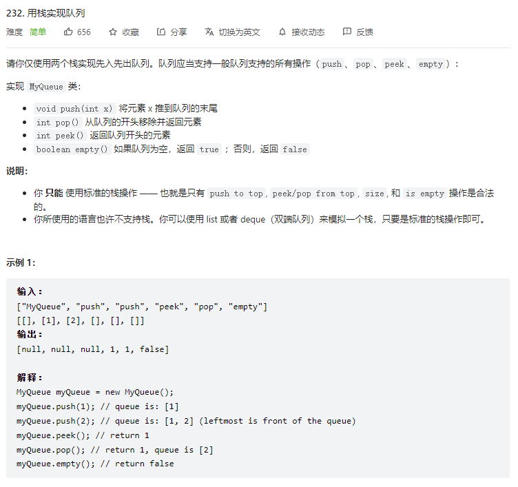
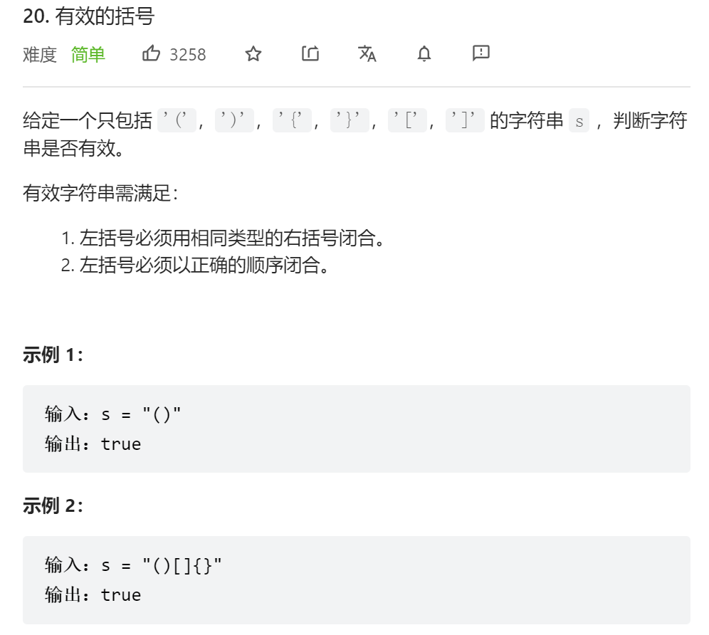
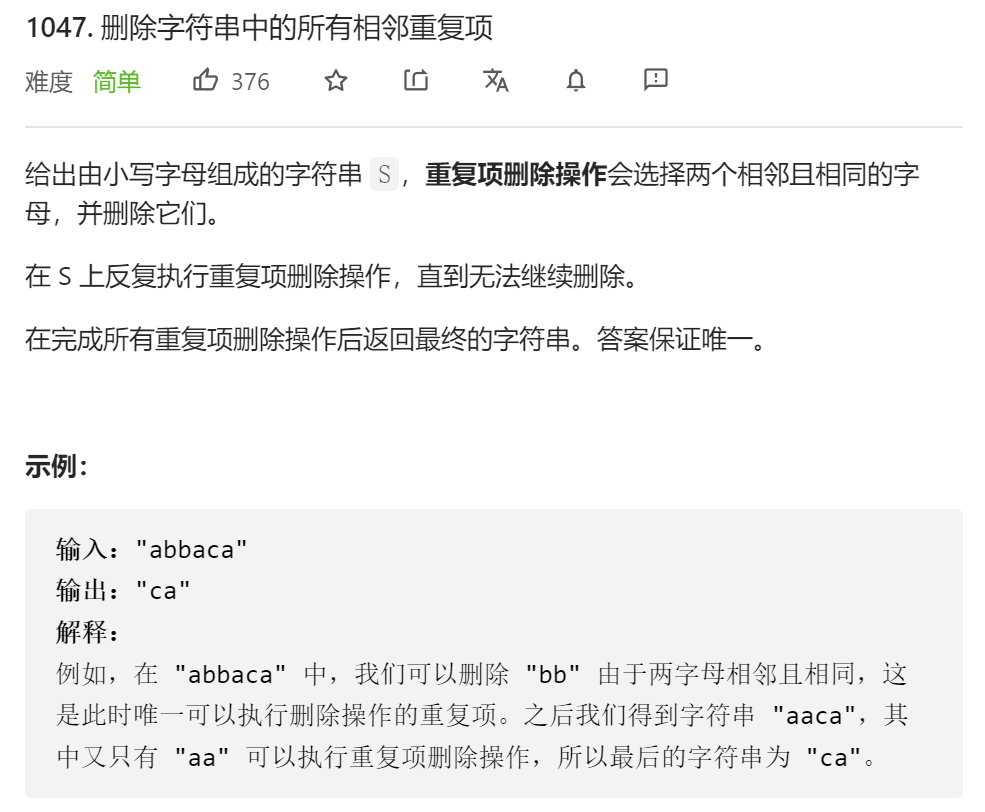
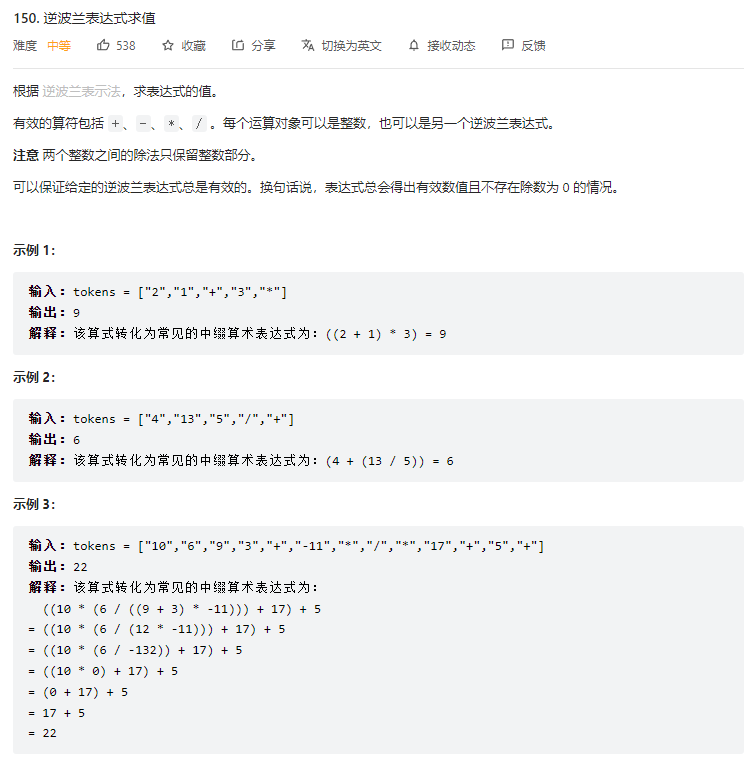
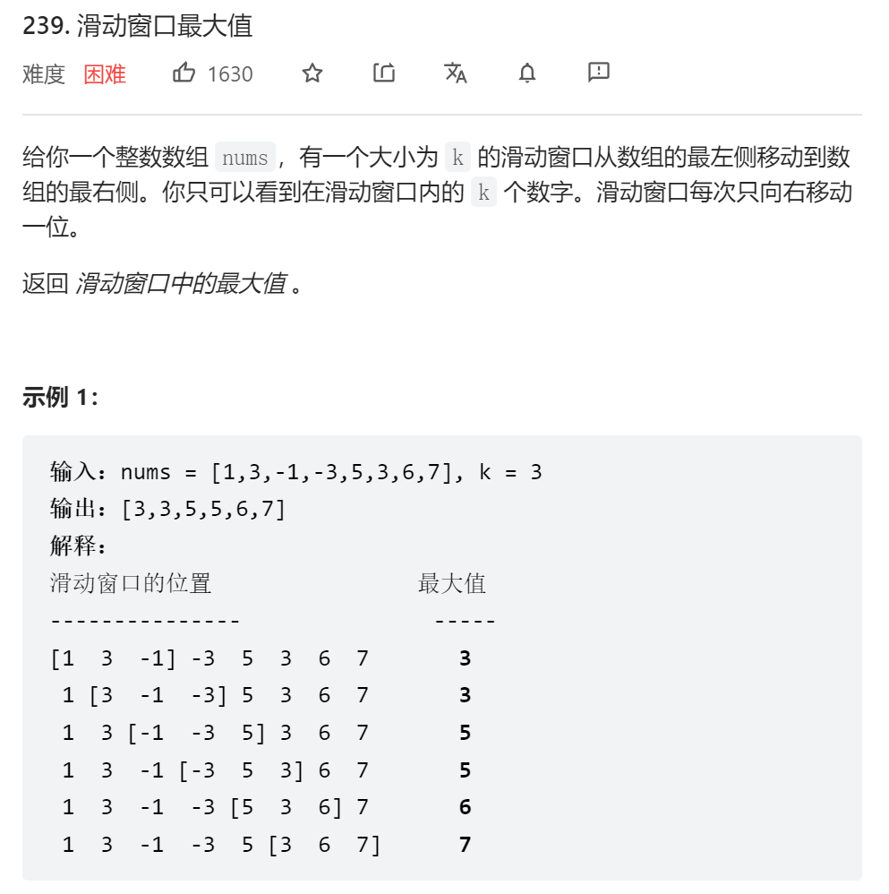
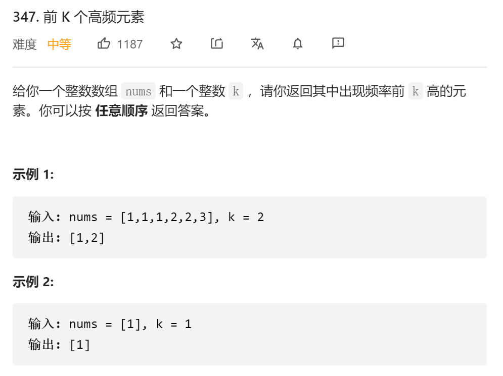

# 栈和队列

## ①🎁用栈来实现队列



```js
var MyQueue = function() {
    this.stackIn = [];
    this.stackOut = [];
};
/** 
 * @param {number} x
 * @return {void}
 */
MyQueue.prototype.push = function(x) {
    this.stackIn.push(x);
};
/**
 * @return {number}
 */
MyQueue.prototype.pop = function() {
    let size = this.stackOut.length;//获取输出栈的大小
    if(!size) {//输出栈若栈空
        while(this.stackIn.length) {//判断输入栈是否为空，不为空则把输入栈的元素一个个放进输出栈
            this.stackOut.push(this.stackIn.pop())
        }
    }
    return this.stackOut.pop();//返回输出栈 栈顶元素
};
/**
 * @return {number}
 */
MyQueue.prototype.peek = function() {
    const x = this.pop();//利用本队列的pop()获取队头
    this.stackOut.push(x);//再把对头放回去stackOut
    return x;//返回队头元素
};
/**
 * @return {boolean}
 */
MyQueue.prototype.empty = function() {
    if(this.stackOut.length === 0 && this.stackIn.length === 0) return true;
    else return false;
};
```

```java
class MyQueue {
    //用两个栈来实现队列 一个输入栈 一个输出栈
    Stack<Integer> stackIn = new Stack();
    Stack<Integer> stackOut = new Stack();
    public MyQueue() {

    }
    
    public void push(int x) {
        stackIn.push(x);//直接加入输入栈
    }
    
    public int pop() {
        if(stackOut.isEmpty()){//出栈前 先判断输出栈是否为空，若为空
            while(!stackIn.isEmpty()){//再判断输入栈是否为空 不为空则把输入栈数据一个个push进输出栈，要一次性push
                stackOut.push(stackIn.pop());
            }
        }
        return stackOut.pop();//返回输出栈栈顶元素 并pop  peek操作同理
    }
    
    public int peek() {
        if(stackOut.isEmpty()){
            while(!stackIn.isEmpty()){
                stackOut.push(stackIn.pop());
            }
        }
        return stackOut.peek();
    }
    
    public boolean empty() {
        if(stackIn == null && stackOut == null) return true;
        else return false;
    }
}
```

## ②🎁有效的括号



```js
var isValid = function(s) {
    let stack = [];
    for(let i = 0; i < s.length; i++) {
        let c = s[i];
        switch(c) {
            case '(' : 
                stack.push(')');
                break;
            case '[' :
                stack.push(']');
                break;
            case '{' :
                stack.push('}');
                break;
            default :
                if(c !== stack.pop()) {
                    return false;
                }
        }
    }
    return stack.length === 0;
};
```

```java
class Solution {
    public boolean isValid(String s) {
        Stack<Character> stack = new Stack<>();
        for(char c : s.toCharArray()){
            if(c == '('){
                stack.push(')');
            }else if(c == '['){
                stack.push(']');
            }else if(c == '{'){
                stack.push('}');
            }else{
                if(stack.isEmpty() || stack.peek() != c) return false;
                else stack.pop();
            }
        }
        return stack.isEmpty();
    }
}
```

## ③🎁删除字符串中的所有相邻重复项



```java
class Solution {
    public String removeDuplicates(String s) {
        Stack<Character> stack = new Stack();
        for(char c : s.toCharArray()){
            if(stack.isEmpty() || stack.peek() != c){
                stack.push(c);
            }else{//栈非空 而且 栈顶元素不等于c，则出栈
                stack.pop();
            }
        }
        String str = "";
        while(!stack.isEmpty()){
            str = stack.pop() + str;//反向添加字符
        }
        return str;
    }
}
```

## ④🎁逆波兰表达式求值



```js
var evalRPN = function(tokens) {
    let map = new Map([
        ["+", (a, b) => a * 1  + b * 1],
        ["-", (a, b) => b - a],
        ["*", (a, b) => b * a],
        ["/", (a, b) => (b / a) | 0]
    ]);
    let stack = [];
    for(item of tokens) {
        if(!map.has(item)) {
            stack.push(item);   
        }else{
            stack.push(map.get(item)(stack.pop(), stack.pop()));
        }
        
    }
    return stack.pop();
};
```

```java
class Solution {
    public int evalRPN(String[] tokens) {
        Stack<Integer> stack = new Stack();
        for(String c : tokens){
            if("+".equals(c)){
                stack.push(stack.pop() + stack.pop());
            }else if("-".equals(c)){
                stack.push(-stack.pop() + stack.pop());
            }else if("*".equals(c)){
                stack.push(stack.pop() * stack.pop());
            }else if("/".equals(c)){
                int tmp1 = stack.pop();
                int tmp2 = stack.pop();
                stack.push(tmp2 / tmp1);
            }else{
                stack.push(Integer.valueOf(c));
            }
        }
        return stack.pop();
    }
}
```

## ⑤🎁滑动窗口的最大值



```java
class Solution {
    public int[] maxSlidingWindow(int[] nums, int k) {
        
        int[] res = new int[nums.length - k + 1];
        for(int i = 0; i < nums.length - 2; i++) {
            int sum = 0;
            int max = Integer.MIN_VALUE;
            for(int j = i; j < i + k; j++) {
                // sum += nums[j];
                max = Math.max(nums[j], max);
            }
            res[i] = max;
        }
        return res;
    }
}
```

## ⑥🎁前k个高频元素



```js
var topKFrequent = function(nums, k) {
    let map = new Map();//创建map
    nums.forEach((item) => {//遍历数组
        map.set(item, map.has(item) ? map.get(item) + 1 : 1);//将数字和数字出现的次数存入map
    });
    //将map转换为数组，再进行定制排序，按值排序 值大排前面
    let arr = Array.from(map).sort((a, b) => b[1] - a[1]);
    //切割数组，再进行map遍历 返回第一个元素 即map中的key(数字)
    return arr.slice(0, k).map((item) => item[0]);
};
```


```js
var topKFrequent = function(nums, k) {
    let obj = {};
    nums.forEach((item) => {//遍历数组 记录每个数字出现的次数
        if(obj[item]){//若已经存在该数字属性 则次数加1
            obj[item]++;
        }else{//若不存在 则设置为1
            obj[item] = 1;
        }
    })
    let arr = [];//声明一个数组
    for(let key in obj) {//遍历对象的key
        arr.push({//把对象的key 和 value 存入数组
            key,
            value: obj[key]
        })
    };
    function dataSort(a, b) {//声明定制排序函数
        //对数组中的value进行排序 逆序return b.value - a.value
        //对数组中的value进行排序 正序return a.value - b.value
        return b.value - a.value;
    }
    arr.sort(dataSort);//对数组进行排序
    //切割前k个最高频的元素，利用map遍历返回key
    return arr.slice(0, k).map((item) => item.key);
};
```


```java
class Solution {
    public int[] topKFrequent(int[] nums, int k) {
        int[] res = new int[k];
        Map<Integer, Integer> map = new HashMap();
        for(int num : nums){//用map记录数字出现次数
            map.put(num, map.getOrDefault(num, 0) + 1);
        }
        //构造优先队列并定制以map的value值来排序 形成小顶堆
        PriorityQueue<Map.Entry<Integer, Integer>> queue = new PriorityQueue<>((o1, o2) -> o1.getValue() - o2.getValue());
        for(Map.Entry<Integer, Integer> entry : map.entrySet()){//遍历map
            queue.offer(entry);
            if(queue.size() > k){//超出所需要的k个元素 就把前面的次数小的出队
                queue.poll();
            }
        }
        for(int i = 0; i < k; i++){//将key放入数组容器中 返回
            res[i] = queue.poll().getKey();
        }
        return res;
    }
}
```

