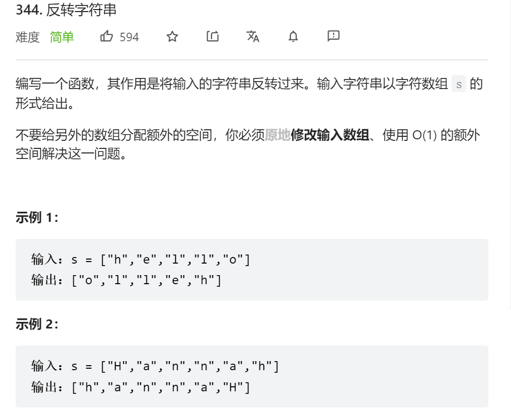
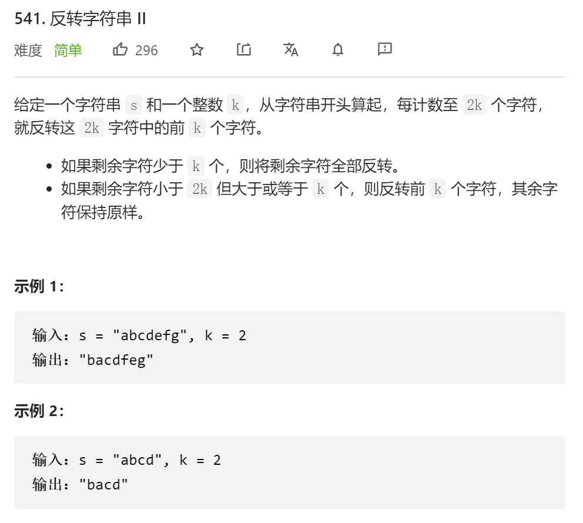
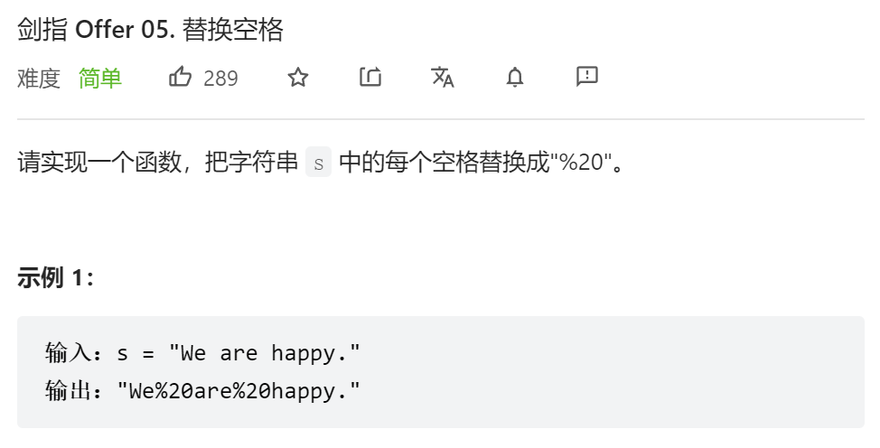
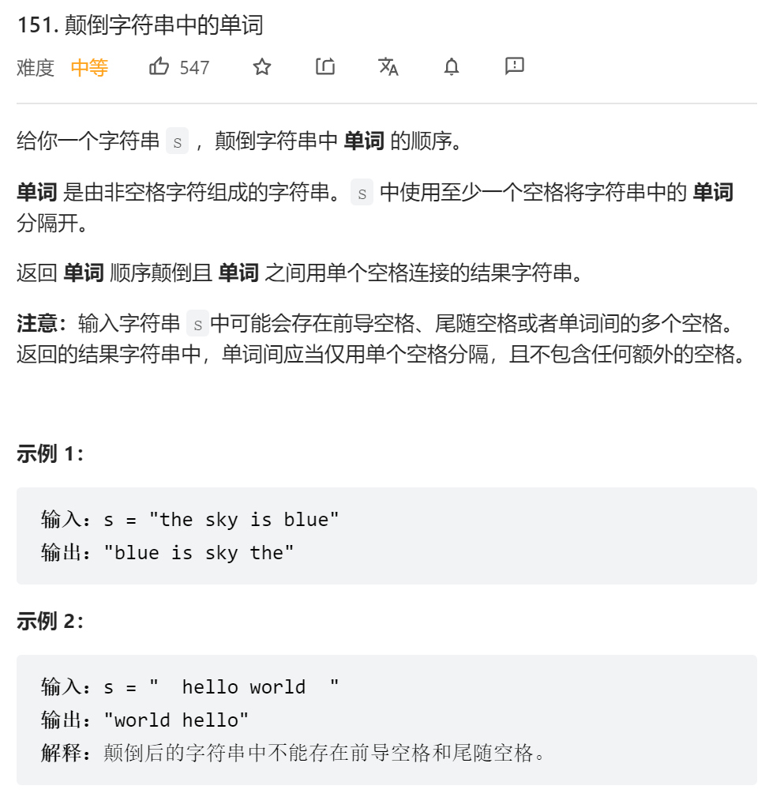
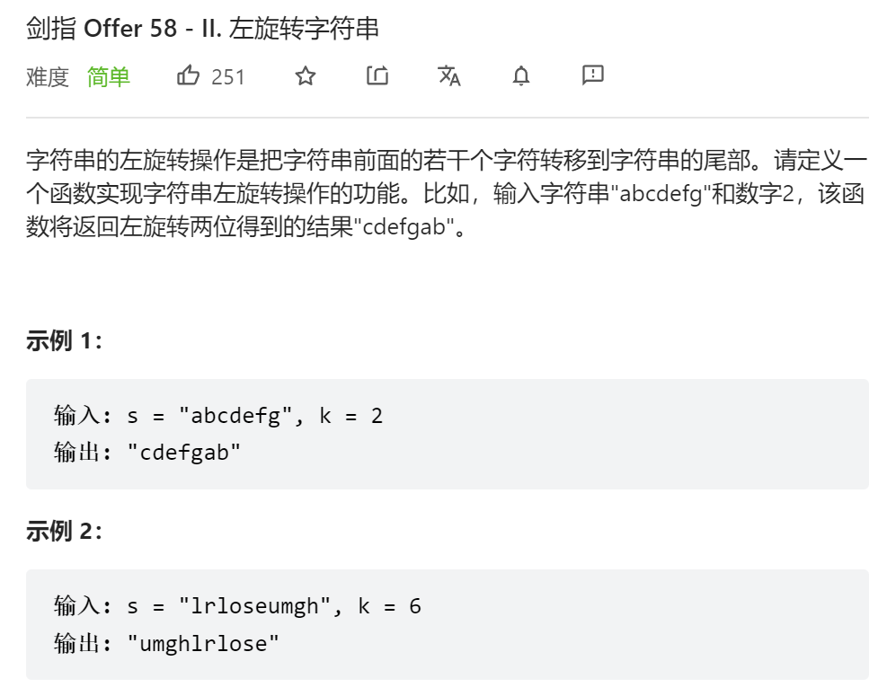
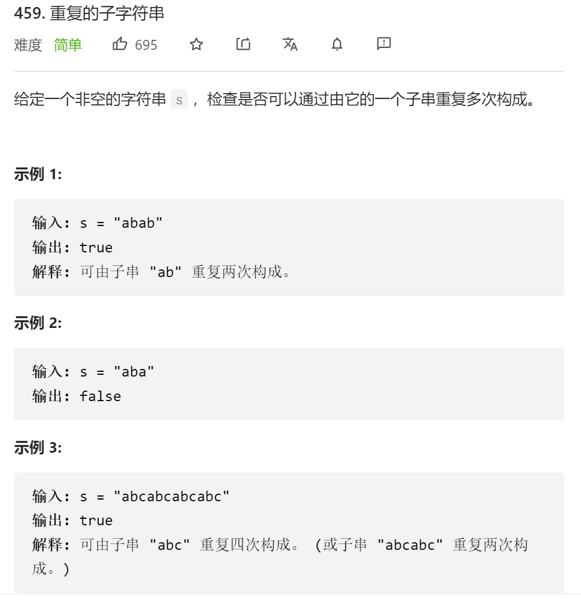
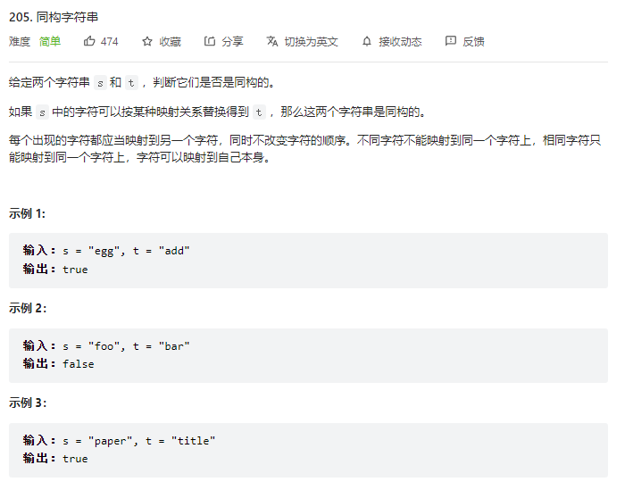

# 🍔反转字符串

## ①✨反转字符串



```js
//1
var reverseString = function(s) {
    for(let i = 0; i < s.length / 2; i++) {//遍历到中间为止
        [s[i], s[s.length - 1 - i]] = [s[s.length - 1 - i], s[i]]//解构赋值，两两交换
    }
};
//2
var reverseString = function(s) {
    let l = 0, r = s.length - 1;
        while(l < r) {
            [s[l], s[r]] = [s[r], s[l]];
            l++;
            r--;
        }
};
//3
var reverseString = function(s) {
	return s.reverse();
};
```

```java
class Solution {
    public void reverseString(char[] s) {
        int n = s.length;
        for(int i = 0, j = n - 1; i < j; i++, j--){
            char tmp = s[i];
            s[i] = s[j];
            s[j] = tmp;
        }
    }
}
```

## ②✨反转字符串Ⅱ



```js
var reverseStr = function(s, k) {
    for(let i = 0; i < s.length; i += 2*k) {
        let start = i;//记录每一次跨越2k个字符的起始下标
        let end = Math.max(s.length - 1, start + k - 1);//记录每次跨越2k个字符的结尾小标
        while(start < end) {
            [s[start], s[end]] = [s[end], s[start]];//用解构赋值来交换前后位置字符
            start++;
            end--;
        }
    }
    return s;
};
```

```java
class Solution {
    public String reverseStr(String s, int k) {
        char[] str = s.toCharArray();//字符串转为字符串数组
        for(int i = 0; i < str.length; i += 2*k){
            int start = i;//记录每一次跳转2k后的起始位置
            //跳转到2k后的末尾位置，它可能超出字符长度
            int end = Math.min(str.length - 1, start + k - 1);
            while(start < end){//每个2k区间中的前k个进行交换
                char tmp = str[start];
                str[start] = str[end];
                str[end] = tmp;
                start++;
                end--;
            }
        }
        return new String(str);
    }
}
```


## ③✨替换空格



```js
/**
 * @param {string} s
 * @return {string}
 */
var replaceSpace = function(s) {
    let str = '';//定义一个空字符串 存放新字符串
    for(let i = 0; i < s.length; i++) {
        //若当前s[i]字符为空格则用%20替换 若不是空格则直接添加s[i]对应的字符
        str += s[i] === ' ' ? '%20' : s[i];
    }
    return str;
};
```

```java
class Solution {
    public String replaceSpace(String s) {
        StringBuilder sb = new StringBuilder();//创建StringBuilder对象
        for(int i = 0; i < s.length(); i++){//遍历字符串
            if(s.charAt(i) == ' '){//当前字符若为空，则添加%20
                sb.append("%20");
            }else{//若不为空，则添加当前字符
                sb.append(s.charAt(i));
            }
        }
        return sb.toString();//返回的同时转换为String
    }
}
```

## ④✨颠倒字符串中的单词



```js
var reverseWords = function(s) {
    s.trim();
    let str = '';
    let i = s.length - 1;
    let j = s.length - 1;
    while(i >= 0) {
        while(i >= 0 && s[i] != ' '){
            i--;
        }
        str += s.substring(i + 1, j + 1) + ' ';
        while(i >= 0 && s[i] == ' ') {
            i--;
        }
        j = i;
    }
    return str.trim();
};
```


```Java
class Solution {
    public String reverseWords(String s) {
        StringBuilder sb = new StringBuilder();//StringBuilder对象存储新字符串
        s.trim();//清空两边的空格
        int i = s.length() - 1;//i j 分别从最后一个字符开始遍历
        int j = s.length() - 1;
        while(i >= 0){
            while(i >= 0 && s.charAt(i) != ' '){//当前字符若非空格，则i前移
                i--;
            }
            sb.append(s.substring(i + 1, j + 1) + ' ');//当前字符为空格 则把单词加入sb中并加上空格
            while(i >= 0 && s.charAt(i) == ' '){//接下来继续判断当前字符前面的字符是否为空格继续遍历
                i--;
            }
            j = i;//遇到非空格 则为下一个单词的结尾
        }
        return sb.toString().trim();//清空右侧的空格
    }
}
```

## ⑤✨左旋转字符串Ⅱ



```js
//1
var reverseLeftWords = function(s, n) {
    return s.substring(n, s.length) + s.substring(0, n);
};
//2
var reverseLeftWords = function(s, n) {
    str = '';
    for(let i = n; i < s.length; i++) {
        str += s[i];
    }
    for(let i = 0; i < n; i++){
        str += s[i];
    }
    return str;
};
```

```java
//1
class Solution {
    public String reverseLeftWords(String s, int n) {
        StringBuilder sb = new StringBuilder();
        for(int i = n; i < s.length(); i++){
            sb.append(s.charAt(i));
        }
        for(int i = 0; i < n; i++){
            sb.append(s.charAt(i));
        }
        return sb.toString();
    }
}
//2
class Solution {
    public String reverseLeftWords(String s, int n) {
        return s.substring(n, s.length()) + s.substring(0, n);
    }
}
```

## ⑥✨重复的子字符串



```js
/**
   模拟优化
   我们不需要去比较每i个字符串
   我们只需要比较前i个和后i个
   以及i到最后一个和前n-i个是否相等
*/
var repeatedSubstringPattern = function(s) {
    let n = s.length;//字符串长度
    let i = 0;//开始位
    while(++i < n) {//i++后判断是否小于字符长度n
        if(n % i != 0) continue;//重复字串长度i是否是字符串长度n的整数倍,不是整数倍就继续循环
        //判断0，i 和 n-i到n 是否相同
        if(s.substring(0, i) === s.substring(n - i, n)) {
            // 判断去掉前或者后的重复字串 剩下的是否相同
            if(s.substring(i, n) === s.substring(0, n - i)) {
                return true;
            }
        }
    }
    return false;//z
};
```


```java
·class Solution {
    public boolean repeatedSubstringPattern(String s) {
        int n = s.length();//字符长度
        int i = 1;//开始位
        while (++i < n) {//i++后判断是否小于字符长度n
            if (n % i != 0) continue;//重复字串长度i是否是字符串长度n的整数倍,不是整数倍就继续循环
            //判断0，i 和 n-i到n 是否相同
            if (s.substring(n - i, n).equals(s.substring(0, i)))
                // 判断去掉前或者后的重复字串 剩下的是否相同
                if (s.substring(i, n).equals(s.substring(0, n - i))) return true; 
        }
        return false;
    }
}
```

## ⑦✨同构字符串



```js
var isIsomorphic = function(s, t) {
    let mapS = {};
    let mapT = {};
    // 每个字符的映射都是唯一的对应关系
    for(let i = 0; i < s.length; i++) {
        if(!mapS[s[i]]) mapS[s[i]] = t[i];// 如果s[i]还没映射的话，s映射到t
        if(!mapT[t[i]]) mapT[t[i]] = s[i];// 如果t[i]还没映射，则t映射s
        if(mapS[s[i]] !== t[i] || mapT[t[i]] !== s[i]) return false;// 判断双向映射是否一一对应
    }
    return true;
};
```

